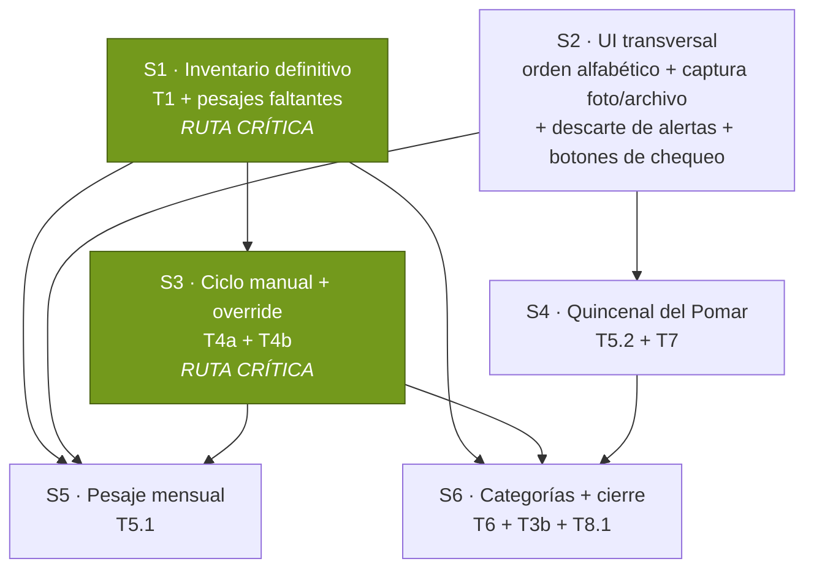

# Plan de trabajo — Módulo Hato Lechero, ronda agosto 2026

Origen: lista de tareas manuscrita del dueño (2026-08-06) + entrevista de scope de la misma fecha.
Insumos entregados: planilla de pesaje Junio 2026 (foto), liquidación quincenal de El Pomar (screenshot),
`INVENTARIO_TIBAGOTA_DEF_2026_2.xlsx` (inventario final depurado, 68 animales).

Este documento es el contrato de la ronda. Cada sesión de abajo es delegable a un agente con su brief.

---

## 0. Decisiones del dueño (2026-08-06)

Estas son decisiones de negocio ya tomadas. **Cambiar una es una decisión del dueño, no un refactor.**

| # | Decisión | Consecuencia |
|---|---|---|
| D-1 | **La identidad de un animal es el NOMBRE, no la chapeta.** Se compran vacas de otras fincas y llegan marcadas, así que una caravana puede repetirse o mudarse. | Invierte el eje con el que se resolvió el histórico en julio 2026 (que usó la chapeta). Toda reconciliación de esta ronda se hace por nombre normalizado. |
| D-2 | El Excel `INVENTARIO_TIBAGOTA_DEF_2026_2.xlsx` hoja "TAREA MEV" es **la fuente de la verdad** del hato vivo. 68 animales. | La hoja "Colisiones a confirmar" queda cerrada sin diligenciar: quien no está en las 68, sale. |
| D-3 | Prefijo **`5` = "S" de Supata** (finca de origen) en la chapeta. FLACA→`5182`, ESMERALDA→`5162`, PACHA→`5202`, MOROCHA→`202`. | Rompe la regla documentada "las caravanas nuevas deben quedar por debajo de 800". La banda provisional sigue siendo 800–999; `5xxx` **no** es provisional y no debe mostrar el chip. |
| D-4 | Las activas que no están en el Excel **salieron vendidas**. Solo se cambia el estado. | **No se toca `fin_ingresos` ni `fin_transacciones_ganado`.** La información histórica de esas ventas se da por perdida — no hay forma de reconstruirla. |
| D-5 | Las marcas manuales del ciclo (preñada / confirmada / seca / parida) se registran como **eventos**, no como campos que pisan el cálculo. Gana el evento más reciente. | Sin capa de override paralela. `secado_real` manual cierra el lazo abierto que hoy infla ~25% el conteo de vacas en ordeño. |
| D-6 | Debe existir **override de cualquier dato ya registrado**, incluso después de guardado. | Es requisito de seguridad de los flujos de OCR: si el parser se equivoca, tiene que haber camino de corrección. |
| D-7 | Solo **Gerencia** edita el ciclo reproductivo. | Martha ya es Gerencia. |
| D-8 | Los tres flujos de carga son **foto primero**, con subida de archivo como fallback. Todo flujo de OCR lleva botón de cámara. | Un único componente compartido, no tres implementaciones. |
| D-9 | La planilla de pesaje tiene **5 columnas de semana**, cada una con AM y PM. | La de junio tenía 4; los meses de 5 miércoles se desbordaban. |
| D-10 | El ingreso de leche pasa de **mensual a quincenal**. | Para que la gráfica quincenal refleje producción real y haga match con la caja. |
| D-11 | **ICA = 2,25%**, retenido por El Pomar. No entra a caja. `fin_ingresos.valor` guarda el **NETO** (`bruto × 0,9775`). | Confirmado contra la fórmula del Excel del dueño: `=IF(ISBLANK(D3),"",D3*0.9775)`. |
| D-12 | El ICA aplica **solo de julio 2026 en adelante**. | Lo histórico queda en bruto. |
| D-13 | Las categorías de inventario se **calculan**, pero con override manual fácil. | Ternera 0–3m (leche) / 3–12m (concentrado) · Novilla 12m→1er parto · Vaca 1er parto→{hato, horro}. Horro = seca. |
| D-14 | Las alertas de Telegram van a **Santiago** mientras prueba. | Falta su chat id. |

Decisiones tomadas tras el informe de reconciliación (misma fecha):

| # | Decisión | Consecuencia |
|---|---|---|
| D-15 | **CORAZA #172, MARGARITA #987 y VANIDOSA #173 se dan de baja**, pese a estar en el chequeo del 2026-07-09. | El Excel es posterior al chequeo y manda (D-2). Se asume que salieron entre el 9 de julio y hoy. Sin fecha de salida y sin registro en Finanzas (D-4). |
| D-16 | **VIOLETA: sobrevive la #174** (5 chequeos, revisada el 2026-07-09) y se le asigna la chapeta **186**. La #186 vacía se da de baja. | Conserva la historia viva. Confirma D-1: la chapeta se mueve, el animal no. |
| D-17 | **FABIOLA: sobrevive la #984** (17 chequeos hasta abril 2026, hija de INDIA, nac 2023) con chapeta **176**. La #993 se da de baja. | La ficha de 2017 con 1 chequeo de 2022 sale. |
| D-18 | **Balde E se trata como fichas nuevas**: CARIOCA, GALLETA, MACARENA y MAYA no se fusionan con su vecino ortográfico. | Fusionar GALLETA con GALLEGA o MACARENA con RICARENA habría colapsado vacas en ordeño con 16 pesajes cada una. El parecido de nombre no es evidencia. |

Decisiones tomadas sobre el diseño de S3 (`docs/plan_hato_ciclo_manual_override.md`), misma fecha:

| # | Decisión | Consecuencia |
|---|---|---|
| D-20 | **"Preñada" y "confirmada" son el mismo `EstadoReproductivo`**, distinguidas por `datos.metodo` (`presuncion` / `palpacion`) y mostradas con chips distintos **solo en la ficha del animal**. Los KPIs del tablero no cambian. | No se agrega un `tipo` nuevo a `hato_eventos`: `ultimo_evento_fecha` es `MAX(fecha)` sobre toda la tabla, así que un tipo que el motor no clasifique tira al animal a `indeterminado` — un tipo nuevo para "preñada" la dejaría *indeterminada*, no preñada. Tampoco se sobrecarga `fecha_confianza`, que significa confianza en la *fecha*. |
| D-21 | **Se puede borrar un evento**, con confirmación explícita y traza de quién/cuándo/qué valores. | Sin borrado, un parto fantasma de un OCR malo queda inflando `num_partos` para siempre. |
| D-22 | El riesgo de **parto duplicado** (marca manual + re-aprobación del chequeo que describe el mismo nacimiento) se **contiene con una advertencia en la UI** antes de guardar; el arreglo de fondo se difiere a S6. | Es un riesgo preexistente desde S8, no introducido por S3. Se re-plantea en S6, que es cuando `num_partos` empieza a decidir quién es vaca y quién novilla (D-13). |
| D-23 | **`dias_espera_voluntaria_post_parto` = 90** (venía en 60 provisional desde la migración 062). | Es el criterio de respaldo que marca una vaca como "vacía problema" **solo cuando el veterinario no opinó** en el último chequeo. Con chequeos bimensuales la mayoría de vacas sí tiene opinión, así que 90 deja el respaldo para los casos donde de verdad se perdió el rastro. Requiere un `UPDATE` sobre `hato_config`. |

**Arquitectura del override (P-3, resuelta por el `cto`)**: **corrección en sitio con traza append-only
obligatoria** — tabla `hato_correcciones` + trigger `AFTER UPDATE OR DELETE` sobre 5 tablas, de modo que
es imposible corregir sin dejar traza. Motivo principal: el módulo ya corrige en sitio en 3 de sus 4
superficies, y `hato_eventos` dejó de ser append-only en la práctica (las tres rondas de limpieza de
julio borraron más de 1.200 eventos). El trigger ignora escrituras de `service_role` (`auth.uid() IS NULL`)
para no auditar re-aprobaciones de chequeo ni la migración de S1. No toca el contrato de la 065.

**D-24 (hallazgo al cerrar S2)**: la "regla que expire las alertas solas" (T3.1c) **ya existía** desde
julio — `DIAS_EXPIRACION_ALERTA = 14` en `hatoAlertas.ts`, aplicada por el tick diario. Tiene un hueco:
`decidirAccionEscalamiento` devuelve `'ninguna'` para cualquier estado terminal, **incluido `escalada`**,
así que una alerta que escaló nunca expira. Eso es exactamente por qué hay 39 `escalada` atascadas.
S2 construyó el complemento (`alertasVencidasParaExpirar`) pero como **botón manual**, para no tocar las
62 alertas de producción el día que despliegue. Decisión: **se queda como botón ahora, y la regla
automática entra al tick en S6**, justo después de que T3b haga el descarte deliberado — así el
`descartada` que pidió el dueño ocurre primero y la regla mantiene limpio de ahí en adelante.

Decisiones tomadas tras la prueba visual en local (2026-08-06, misma fecha):

| # | Decisión | Consecuencia |
|---|---|---|
| D-26 | **La categoría la decide UNA sola función** (`clasificarAnimalHato`): calcula la etapa efectiva primero y con esa alimenta a `derivarEstadoReproductivo`. | Cierra la contradicción en que la pestaña agrupaba por etapa calculada y el chip salía de la etapa manual — seis terneras aparecían con chip "Novilla". Chip, pestaña y Esco ya no pueden discrepar: salen del mismo valor. |
| D-27 | **Terneras se diferencian por sub-etapa**: `Leche (0–3 m)` · `Concentrado (3–12 m)` · `Sin dato de edad`, con chip por fila y barra de conteos. Los umbrales salen de `hato_config`. | "Sin dato de edad" es un balde propio: una ternera sin fecha de nacimiento **no** se mete a la fuerza en leche ni en concentrado. Es la regla de "ausencia de dato ≠ 0" aplicada a un conteo que después va a alimentar la proyección de concentrado. |
| D-28 | La columna **Producción** de la tabla de animales usa el **promedio móvil de 4 semanas** (`rendimientoPorVaca.actual`), no la última pesada suelta. | Es la misma cifra que ya muestra el Ranking de Vacas, así que el módulo no tiene dos números para lo mismo. La ventana se ancla al último pesaje real, no a "hoy", o el atraso de junio→agosto la vaciaría. |
| D-29 | **Orden de columnas**: `#` · Nombre · Estado · Último parto · Próximo evento · Raza · Producción · Acciones. Las acciones son botones, no texto. | `Raza` baja al final: está vacía en las 179 fichas y ocupaba el tercer lugar de la tabla sin aportar. |

**Fuera de alcance de esta ronda** (acordado explícitamente): la herramienta de Esco para proyectar
consumo de concentrado. Se apunta como idea, no se construye.

---

## 1. Consecuencias que hay que asumir a ojos abiertos

Estas salen directo de las decisiones de arriba. No son objeciones — son cosas que van a pasar y que
conviene tener escritas para que nadie las lea después como un bug.

1. **El P&G de 2026 queda partido en dos bases** (D-11 + D-12): ene–jun en bruto, jul–dic en neto.
   Comparar meses entre sí dentro de 2026 arrastra un 2,25% de sesgo.
2. **`fin_ingresos` de leche deja de cuadrar 1:1 contra la liquidación del Pomar** (D-11). La
   liquidación de julio q2 dice `$11.876.000`; el sistema va a decir `$11.608.790`.
   *Mitigación obligatoria*: guardar el **precio bruto por litro** en `hato_produccion_quincenal`
   (columna nueva) y el porcentaje de retención en `hato_config` (editable desde Ajustes, nunca una
   constante en código). Así bruto e ICA son recuperables y auditables desde el dato guardado, y el
   invariante `valor = cantidad × precio_unitario` se conserva usando el precio neto.
3. **Se pierde el histórico de ventas de los animales dados de baja** (D-4). Decisión consciente.
4. **Activar Telegram antes de limpiar alertas le mandaría a Santiago 39 alertas escaladas viejas**,
   varias con `fecha_programada` en 2019. Por eso T3b va **antes** que T8.1 en el grafo.

---

## 2. Estado verificado de producción (2026-08-06)

Medido, no supuesto.

- `hato_animales`: **80 activa** (35 vaca · 36 novilla · 9 ternera) · 91 no activas. El Excel trae 68.
- `hato_eventos`: solo `servicio` (412), `parto` (300), `aborto` (23). **Cero `secado_real`** → ninguna
  vaca puede llegar a `seca` → "horro" siempre da 0.
- `hato_pesajes_leche`: junio 2026 cargado, 4 fechas (los 4 miércoles: 03, 10, 17, 24), 27–28 filas
  cada una. La planilla de papel tiene ~31 vacas con datos → **faltan pesajes por cargar** (FLACA entre
  ellos, hoy marcada `vendida`).
- `litros_am` / `litros_pm` **sí se usan** y `litros_total` es la suma. La planilla de papel y la BD
  coinciden exactamente (ALINA S1 = 7 + 8 → 15).
- `hato_produccion_quincenal`: **todas las filas son `derivado_mensual`**, ninguna `medido`. Última:
  junio 2026 q2. Julio no existe.
- `fin_ingresos` de leche: **mensual**, las dos quincenas de un mes comparten el mismo ingreso.
  `valor` es bruto. No hay retención modelada en ninguna parte del sistema.
- `hato_alertas`: 62 filas — 39 `escalada`, 20 `descartada`, 2 `expirada`, 1 `respondida`.
- `hato_alertas_config.destinatario_telegram_id` = NULL en las 5 filas (lazo abierto desde julio).
- `hato_eventos.tipo` CHECK **ya admite** `confirmacion_prenez`, `secado_real`, `cambio_etapa`,
  `rechequeo`, `celo`; `fuente` ya admite `'web'` → **T4a no necesita migración de esquema**.
- `hato_produccion_quincenal` tiene `CHECK ((origen_dato='medido' AND litros_total IS NULL) OR
  (origen_dato='derivado_mensual' AND litros_total IS NOT NULL))` → los litros de una quincena medida
  viven en `fin_ingresos.cantidad`, y el precio bruto **no tiene columna** hoy.
- Cobertura de `fecha_nacimiento` en activas: ternera 9/9 · novilla 32/36 · vaca 20/35.
  Suficiente para D-13 (las vacas se definen por 1er parto, no por edad).

---

## 2.b Reconciliación por nombre — resultado (2026-08-06, verificado)

Los 68 del Excel contra las 171 fichas de `hato_animales`, por nombre normalizado, sin filtrar por estado.

| Balde | Qué es | n |
|---|---|---|
| A | Coincidencia única, ya `activa` | 49 |
| B | Coincidencia única, pero `vendida` | 2 — **pero solo 1 se reactiva** |
| C | Coincidencia múltiple (2–3 fichas homónimas) | 10 |
| D | Sin coincidencia → ficha nueva | 3 |
| E | Sólo coincidencia aproximada (distancia ≤2) | 4 |

**D-1 queda validada por los datos.** 22 fichas cargan números provisionales 974–999 precisamente porque
la chapeta de planilla estaba repetida (pares 43, 113, 116, 151, 162, 175, 176, 179, 181, 182, 183);
8 de ellas siguen activas. La chapeta ya había fallado como identidad antes de que nadie lo dijera.

**Los 8 "renombramientos" del diff por chapeta son animales nuevos, confirmado.** CAMELIA, CARIOCA,
GALLETA, MACARENA, MAYA, MONARCA, MOROCHA y ESPERANZA no tienen ficha ni historia. Las chapetas que
reclaman (207, 210, 211, 212, 213, 192, 202) las ocupan hoy crías nacidas entre dic-2025 y may-2026 con
**0 eventos, 0 chequeos y 0 pesajes** — así que el mapeo por chapeta no habría destruido historia, pero
sí habría colapsado 8 pares de animales distintos en 8 fichas. El único con historia real es **FLACA**,
y su problema es de estado, no de identidad.

**Orden de ejecución obligatorio**: hay 5 chapetas en conflicto (207, 210, 211, 212, 213) entre las
fichas actuales y las filas del Excel. **Hay que desactivar antes de activar** o la migración falla
contra `hato_animales_numero_activa_unique`.

**Con las 4 correcciones de D-3 no queda ninguna colisión**: 68 chapetas distintas sobre 68 animales.
Además `numero` es `integer`, así que el `S162` del Excel **no es almacenable** — pasar a 5162 no es
una preferencia, es un requisito para poder escribir la fila.

**Nadie del grupo a dar de baja tiene un solo pesaje.** Las 27 vacas del pesaje más reciente
(2026-06-24) están todas en el Excel. Toda la exposición de la baja está en `hato_chequeo_vacas`.

### Conflicto entre el Excel y el registro veterinario más reciente

El chequeo del **2026-07-09** (39 vacas, el más reciente que existe) incluye a **CORAZA #172,
MARGARITA #987 y VANIDOSA #173**, que **no aparecen en el Excel de 68**, y a **VIOLETA #174**, mientras
el Excel declara VIOLETA con chapeta 186 (una ficha distinta, sin historia). También incluye a
**FLACA #978 marcada `vendida`** — contradicción directa que confirma que su baja es un error.

El Excel es posterior al chequeo, así que la lectura más probable es que esas tres salieron entre el
9 de julio y hoy. Pero D-4 dice "las que no están, salieron", y aplicarlo a ciegas contradiría el
último registro veterinario. **Requiere confirmación explícita antes de ejecutar S1.**

### Errores de datos encontrados de paso (no pedidos)

1. **Cero eventos `venta` y `muerte` en toda la tabla.** Las 91 fichas `vendida` no tienen evento de
   salida y 28 tampoco tienen `fecha_estado`. No hay forma de auditar cuándo ni por qué salió un animal.
2. **`raza` es NULL en las 171 fichas**, pese a que `hato_config.razas` mantiene el catálogo. Nada la puebla.
3. **`FLACA #978`**: `fecha_nacimiento` 2024-03-15 con un parto en 2022-07-22. Imposible.
4. **`VICTORIA #180`**: parto el 2026-03-28 y una cría (`VIKINGA #215`) nacida el 2026-06-26 — 90 días.
   Una de las dos fechas está mal. Su etapa además es `novilla` en BD y `vaca` en el Excel.
5. **69 de 171 fichas sin `fecha_nacimiento`.** Afecta a T6 (categorías por edad) sólo en vacas, que se
   definen por 1er parto.
6. **`abundantia`, `gala`, `rochi`** están en minúsculas, con etapa `ternera` y 7–9 años de edad.
   Son fichas basura de la carga histórica, no animales.

---

## 2.c Estado de aplicación a producción (2026-08-06)

| Migración | Qué hace | Estado |
|---|---|---|
| `083` | Inventario definitivo: 68 activas | ✅ aplicada |
| `083b` | 12 pesajes de junio faltantes | ✅ aplicada |
| `084` | `hato_correcciones` + traza + espera 90 días | ✅ aplicada |
| `085` | ICA 2,25% + liquidación del Pomar | ✅ aplicada |
| `086` | Bucket privado de fotos de pesaje | ✅ aplicada |
| `087`, `088` | — | **no existen** (hueco de renumeración de S6) |
| `089` | Categorías calculadas: umbrales + `fecha_nacimiento` en la vista | ✅ aplicada |
| `090` | Descarte de las 42 alertas históricas | ✅ aplicada |
| `091` | Telegram de las alertas → Santiago (`8505349717`) | ✅ aplicada |
| `092` | Override real de categoría (ver abajo) | pendiente |

**Edge functions desplegadas** a producción el 2026-08-06 (`make-server-1ccce916`, 3,6 MB): endpoints
de OCR de liquidación y de planilla de pesaje, y la fase (d) del tick de alertas.

**El lazo abierto del módulo quedó cerrado**: `hato_alertas_config.destinatario_telegram_id` está
poblado en las 5 filas. Las alertas empiezan a llegar de verdad en el tick de las 05:45 Bogotá.

**Orden que se respetó y por qué**: 090 (descarte) **antes** de 091 (Telegram), o las 42 alertas
históricas — varias con fecha programada en 2019 — le habrían llegado de golpe al teléfono.

**D-25 (decisión del dueño al revisar S6)**: la precedencia de la categoría queda **al revés de como
S6 la implementó**. S6 dejó el cálculo mandando siempre que se pudiera calcular, con lo manual solo
como respaldo cuando falta `fecha_nacimiento`. Eso deja sin salida el caso más probable — una fecha
de nacimiento **presente pero equivocada** — y además `EditarAnimalDialog` seguía aceptando el cambio
de etapa sin que tuviera efecto. **Lo manual, cuando se fija explícitamente, gana**; debe verse que
está forzada y debe poder volverse al cálculo automático. Migración **092**, pendiente.

---

## 3. Grafo de desarrollo

**Ruta crítica: S1 → S3 → S6.** Todo lo demás cuelga de ahí o corre en paralelo.

**Arrancan de inmediato, sin esperar a nadie:** S1, S2, y el diseño de contrato de S3.

| Sesión | Depende de | Puede arrancar | Agente sugerido |
|---|---|---|---|
| S1 | — | ya | `data-integrity` (verificación) → `backend` (migración) |
| S2 | — | ya | `frontend` |
| S3 | S1 para operar; contrato puede diseñarse ya | ya (diseño) / tras S1 (ejecución) | `cto` → `backend` + `frontend`, con `qa` en paralelo |
| S4 | S2 (componente de captura) | tras S2 | `backend` + `frontend` |
| S5 | S1, S2, S3 | tras los tres | `backend` + `frontend` |
| S6 | S1, S3, S4 | tras los tres | `backend` + `frontend` |

---

## 4. Briefs por sesión

### S1 · Inventario definitivo — RUTA CRÍTICA · ✅ APLICADA A PRODUCCIÓN 2026-08-06

**Migraciones `083_hato_inventario_definitivo_agosto_2026.sql` y
`083b_hato_pesajes_junio_2026_faltantes.sql` aplicadas y verificadas.** Estado final medido:

| | Antes | Después |
|---|---|---|
| `hato_animales` totales | 171 | 179 |
| Activas | 80 | **68** (35 vaca · 27 novilla · 6 ternera — idéntico al Excel) |
| Chapetas duplicadas entre activas | 0 | 0 |
| Eventos `venta` en `hato_eventos` | 0 | 21 |
| FLACA | `vendida` #978 | `activa` **#5182** |
| VICTORIA | `novilla` | `vaca` |
| Pesajes junio 2026 (vacas por fecha) | 27 · 28 · 28 · 27 | **30 · 31 · 31 · 30** |

Backup de las 31 filas modificadas en `respaldos.backup_083_hato_animales_pre_mev` (31 filas, RLS
activo, sin políticas). Rollback documentado al pie de cada migración. **Borrar el backup solo cuando
el dueño confirme que el hato de 68 se ve correcto en la app.**

Consecuencia a tener presente: el total de litros/día del hato en junio subió de 397–507 a **441–564**
al entrar FABIOLA, FLACA y VICTORIA. Cualquier lectura previa del tracker para ese mes estaba
subestimada, no por un error de cálculo sino por cobertura de pesaje incompleta — que es exactamente
el riesgo R-4 que `ProduccionView` ya declara en pantalla.

**Aviso para S3**: la migración 084 se escribió mientras 083 aún no se había aplicado. Si sus guards
fijan conteos de `hato_animales`, hay que revalidarlos contra el estado nuevo (179/68) antes de
aplicarla.

#### Brief original

**Objetivo**: dejar `hato_animales` reflejando exactamente las 68 del Excel, sin perder historia.

Alcance:
1. Reconciliar los 68 **por nombre normalizado** (D-1), no por chapeta. El informe de verificación
   clasifica cada uno en: ya activa · vendida a reactivar · nombre ambiguo · ficha nueva · coincidencia
   aproximada.
2. Reasignar chapetas según D-3, y resolver los provisionales 800–999 a sus números reales del Excel
   (hoy hay 23 animales en esa banda; el Excel da número real para varios: CUÑA 43, MONA 175,
   VENUS 151, FABIOLA 176, VITROLA 162).
3. Dar de baja (`estado='vendida'`) las activas que no están en el Excel. **Sin tocar Finanzas** (D-4).
4. Reactivar las que están `vendida` y sí están en el Excel (FLACA confirmada; el informe dirá si hay más).
5. Crear ficha nueva para las que no tengan historia (ESPERANZA #179 es candidata).
6. Corregir etapas divergentes (VICTORIA: prod `novilla` vs Excel `vaca`).
7. Cargar los pesajes de junio 2026 que faltan (~3–4 vacas de la planilla, FLACA incluida).

**Lista de trabajo resuelta** (68 = 59 ya activas + 1 reactivación + 8 fichas nuevas):

| Operación | n | Detalle |
|---|---|---|
| Bajas (`estado='vendida'`) | **21** | Las 17 huérfanas + los 4 excedentes de homónimos (CUTA #207, FABIOLA #993, MORA #212, VIOLETA #186). Incluye las 3 de D-15 y las 3 fichas basura (`abundantia`, `gala`, `rochi`). **Sin tocar Finanzas.** |
| Reactivación | **1** | FLACA `#978 → 5182`, `vendida → activa`. |
| Fichas nuevas | **8** | CAMELIA 210, CARIOCA 207, ESPERANZA 179, GALLETA 192, MACARENA 213, MAYA 211, MONARCA 212, MOROCHA 202. Todas sin historia previa (verificado). |
| Renumeraciones | **9** | CUÑA 997→43 · ESMERALDA 999→**5162** · MONA 986→175 · VENUS 990→151 · VITROLA 998→162 · FABIOLA 984→176 · VIOLETA 174→186 · PACHA 202→**5202** · FLACA 978→**5182** |
| Correcciones de etapa | **1** | VICTORIA #180: `novilla → vaca`. |
| Pesajes faltantes | ~4 | Filas de la planilla de junio 2026 que nunca se cargaron (FLACA entre ellas). |

Ocho de las bajas liberan la chapeta que reclama una ficha nueva o renumerada
(207, 210, 211, 212, 213, 192, 175, 176) — **por eso el orden es: bajas → renumeraciones → altas.**
Cualquier otro orden viola `hato_animales_numero_activa_unique`.

Los 8 homónimos limpios del balde C (ALMA, BRENDA, CONCHA, CUTA, FLAUTA, MORA, POLA, VIKINGA) se
resuelven solos: sobrevive la ficha activa cuya chapeta coincide con el Excel; la otra es una vaca
vendida hace años que prestó el nombre a una cría.

Reglas duras:
- **`UPDATE ... WHERE id` dirigido. Nunca re-correr `load.ts`** — es backfill único, para siempre.
- Backup previo **en el esquema `respaldos`, nunca en `public`** (migración 081).
- Migración guardada con `RAISE EXCEPTION` si los conteos previos/posteriores no cuadran exactamente
  (patrón de 080/081). El incidente de corrupción de 2026-07-23 es la razón.
- El índice `hato_animales_numero_activa_unique` es parcial (único sobre `numero` donde
  `estado='activa'`): las reasignaciones transitorias no colisionan si van en una sola transacción.

Entregable adicional: actualizar la nota de identidad en `src/components/hato/CLAUDE.md` con D-1 y D-3,
y verificar que `esNumeroProvisional()` no marque `5xxx` como provisional.

---

### S2 · UI transversal

**Objetivo**: las tres piezas de interfaz que el resto de sesiones va a reutilizar. Sin esquema, sin RPC.

1. **Orden alfabético** (T2): por defecto en **toda tabla que muestre nombres de animales**, con
   encabezados ordenables. Martha ubica por nombre, no por número. Cubre: Animales, Chequeos, Detalle
   de chequeo, grid de pesaje, Alertas, Pajillas, Ranking de producción, tabla de chequeos de la Hoja
   de Vida.
2. **Componente de captura compartido** (D-8): un solo botón que abre dropdown con "Tomar foto"
   (`capture="environment"` para que abra la cámara en celular) y "Subir archivo". Reemplaza los
   botones sueltos del flujo de chequeo (T5.7). Lo consumen S4 y S5.
3. **Alertas** (T3a): descarte masivo (selección múltiple + acción) y regla de expiración automática.
   La limpieza de las 62 existentes **no** va aquí — va en S6, después de que S3 arregle la causa.

Ojo: Tailwind está congelado. Cualquier clase nueva debe existir en `src/index.css` o entrar como regla
real en `src/styles/globals.css`. Hay un guard estático por si acaso.

---

### S3 · Ciclo reproductivo manual + override — RUTA CRÍTICA · backend ✅ APLICADO 2026-08-06

**Migración `084_hato_correcciones.sql` aplicada y verificada**: tabla `hato_correcciones` creada
(RLS on, 1 política de SELECT, 0 grants de escritura para `anon`/`authenticated`), **5 triggers**
instalados, función `SECURITY DEFINER` con `search_path` fijado, y `dias_espera_voluntaria_post_parto`
= **90** (D-23). No se modificó ni una fila de las 5 tablas fuente.

Motor: desempate determinista por avance de ciclo + estado `seca`/`preñada` sin ancla de servicio.
Las tres copias en paridad byte a byte. **Pre-vuelo medido en producción: 0 grupos de eventos
empatados en la misma fecha**, así que el desempate no altera el estado de ningún animal existente —
es preventivo para lo que las marcas manuales van a crear.

**Fase 2 y Fase 4 completas (2026-08-06)**: `hatoCicloManual.ts` (lógica pura de las 4 marcas, con
bloqueos y advertencias), `hatoCorrecciones.ts`, `MarcarCicloDialog` / `EditarEventoDialog` /
`HistorialCorreccionesCard`, entrada Gerencia-only desde Hoja de Vida y lista de animales, chip de
origen-chequeo en la línea de tiempo. `RegistrarPartoDialog.tsx` y `useEventoRapidoHato.ts`
**eliminados** — absorbidos por `MarcarCicloDialog` (verificado: cero referencias huérfanas en código).
1.876 tests pasan, lint 0 errores, cero clases nuevas de Tailwind.

**Diferido a propósito**: borrar un pesaje (criterios 26–27) — esos archivos los tenía la sesión S4
abierta en paralelo.

#### Brief original

**Objetivo**: que Martha pueda fijar el estado de una vaca y corregir cualquier dato mal capturado.

**T4a — marcar el ciclo** (D-5, D-7):
- Cuatro marcas: preñada · confirmada · seca · parida.
- Se escriben como `hato_eventos` con `fuente='web'`. Mapeo: confirmada → `confirmacion_prenez`,
  seca → `secado_real`, parida → `parto`. Preñada se resuelve del servicio; si hace falta un evento
  propio, `confirmacion_prenez` con confianza distinta antes que inventar un tipo nuevo.
- **No requiere migración**: el CHECK ya los admite (verificado 2026-08-06).
- Gana siempre el evento más reciente. Sin columna de override.
- Solo Gerencia.
- Efecto colateral buscado: la primera marca `seca` cierra el lazo abierto y desinfla el conteo de
  vacas en ordeño.

**T4b — override transversal** (D-6):
- Poder corregir datos ya registrados: eventos, pesajes, quincenales, filas de chequeo.
- Es el prerrequisito de seguridad de S4 y S5: sin esto, un OCR equivocado no tiene salida.
- Decisión de arquitectura pendiente para el `cto`: corrección **in situ con traza de autor** vs
  **evento correctivo** que supersede al anterior. La segunda respeta el append-only del módulo; la
  primera es más simple de usar. Definir antes de implementar.
- `hato_eventos` no tiene trigger de `created_by` — se setea explícito desde la sesión (precedente S9).

**QA en paralelo**: el `qa` escribe los criterios de aceptación antes de que el `backend` implemente,
y trata de falsificar el supuesto "gana el evento más reciente" con casos de chequeo re-subido.

---

### S4 · Quincenal del Pomar · ✅ APLICADA A PRODUCCIÓN 2026-08-06

**Migración `085_hato_quincenal_ica_pomar.sql` aplicada y verificada**: `retencion_ica_leche` = `0.0225`,
columna `precio_bruto_litro`, bucket privado `hato-liquidaciones-fotos` con 4 políticas, RPC
`fn_hato_guardar_quincena_venta` reemplazado (`anon` sin EXECUTE). Endpoint de OCR de la liquidación
y formulario que captura **bruto** y muestra ICA/neto calculados.

**Verificación del cuerpo vivo antes del `CREATE OR REPLACE`** (el paso que el brief exige y que la
sesión no pudo hacer por falta de acceso de lectura): se extrajo `pg_proc.prosrc` de producción y se
comparó contra el texto de la 070. Resultado: **0 líneas existen solo en producción** y **0 líneas de
código difieren** — las 25 líneas de diferencia son todas comentarios que se perdieron cuando la 070
se aplicó. No había hotfix oculto, así que el reemplazo fue seguro. **Dejar constancia: el cuerpo vivo
de una función puede diferir del archivo del repo solo en comentarios; comparar longitudes engaña
porque `length()` cuenta caracteres y `wc -c` cuenta bytes, y estos comentarios llevan tildes.**

Ventana de ruptura asumida a conciencia (decisión del dueño): la 085 cambia el contrato del RPC
(`valor` → `valor_bruto`), así que el formulario de quincena **desplegado hoy** falla hasta que esta
rama salga a producción. Riesgo aceptado porque nunca se ha guardado una quincena `medido`
(verificado: 0 filas) y la pantalla es Gerencia-only.

Deuda que deja esta sesión, no bloqueante:
- `hatoSchemaContract.test.ts` valida el contrato del RPC parseando el **texto de la 070**, que la 085
  ya superó en la base viva. Pasa, pero su red de seguridad quedó revisando texto viejo.
- `KpisVentaHato.tsx` no muestra agregados de bruto/ICA/neto por periodo — los tres renglones solo
  están a nivel de registro en el formulario y su historial.
- El parser de la liquidación se construyó contra la **estructura** del documento, no contra el único
  ejemplar disponible (julio Q2). **Falta una segunda liquidación real (julio Q1) para confirmarlo.**
- Esco no menciona el ICA en su prompt; lee `fin_ingresos.valor`, que ya trae el neto correcto.

#### Brief original

**Objetivo**: que la liquidación quincenal entre por foto y quede como ingreso quincenal neto.

1. **OCR de la liquidación** (D-8): extrae proveedor, NIT, mes, quincena, periodo, precio promedio,
   cantidad (litros), subtotal. Mismo patrón que el OCR de chequeo: el modelo produce la matriz cruda,
   el parser existente interpreta. Foto primero, archivo como fallback.
2. **Defaults editables**: comprador "El Pomar", medio de pago "Cuenta Fovemsa", región "Subachoque",
   fecha de pago = fecha de carga.
3. **Mensual → quincenal** (D-10): el ingreso de leche pasa a una fila de `fin_ingresos` por quincena.
   Lo histórico (`derivado_mensual`, dos quincenas compartiendo un ingreso) se queda como está.
4. **ICA 2,25%** (D-11, D-12, y la mitigación de §1.2):
   - Nueva clave en `hato_config` (p. ej. `retencion_ica_leche` = `0.0225`), editable desde Ajustes.
     **Nunca una constante en código** — es la regla del módulo.
   - Nueva columna en `hato_produccion_quincenal` para el **precio bruto por litro**.
   - `fin_ingresos.valor` = neto; `precio_unitario` = precio neto, de modo que
     `valor = cantidad × precio_unitario` se sigue cumpliendo.
   - Aplica solo a filas nuevas de julio 2026 en adelante.
5. **Vista de Producción** (T7): mostrar los tres renglones — ingreso bruto (capturado), ICA
   (calculado), ingreso neto (calculado) — más vacas en ordeño y litros totales, que siguen siendo
   **capturados a mano, nunca derivados**.

El RPC `fn_hato_guardar_quincena_venta` (migración 070) es el camino de escritura. Es `SECURITY INVOKER`
por diseño: el llamador es una sesión Gerencia que ya tiene RLS de escritura.

---

### S5 · Pesaje mensual

**Objetivo**: que la planilla mensual de papel entre por foto en vez de digitarse vaca por vaca.

1. **Generar el PDF de la planilla en blanco**: roster de vacas en ordeño **vigente** (sale de S1),
   orden alfabético (sale de S2), **5 columnas de semana × (AM, PM)** (D-9) más TOTAL.
   Esto es lo que evita que la planilla se desactualice: la de junio traía CHISPA y DACOTA (vendidas)
   y le faltaba VICTORIA, escrita a mano al final.
2. **OCR de la foto** → matriz cruda de 5×2 por vaca → preview con diff → commit. Mismo contrato que
   chequeo: una celda ilegible entra como **celda vacía + flag**, nunca como una adivinanza; una fila
   cuyo nombre impreso no está en el roster se marca **no leída** y no se desplaza.
3. **Fechas**: los miércoles del mes (`hato_config.dia_pesaje_semanal`), hasta 5.
4. **AM y PM por separado** (D-9), como está en la planilla y como ya lo guarda la BD.
5. Fallback de subida de archivo.

Regla del módulo que sigue vigente: una vaca sin fila de pesaje es **"sin dato" (—), nunca 0**.

---

### S6 · Categorías + cierre

1. **T6 — categorías calculadas con override** (D-13):
   - ternera 0–3 meses (leche) · ternera 3–12 meses (concentrado) · novilla 12m→1er parto ·
     vaca 1er parto→{hato, horro}. Horro = seca.
   - Calculadas de `fecha_nacimiento` + partos, **editables** si el cálculo falla.
   - Toca `hatoCategorias.ts` **y** `categorizarAnimal` en las dos copias de `hato-aggregation.ts`:
     la UI y Esco nunca pueden discrepar en el mismo conteo.
   - Depende de S3: sin `secado_real` no hay horro.
2. **Marcar a mano las 9 vacas que hoy están en horro** — operación de Martha en la UI, una vez S3 esté
   en producción.
3. **T3b — descartar todas las alertas pasadas**. Después de S3, para no descartar alertas que sí eran
   válidas y para que lo que quede sea el flujo nuevo y correcto.
4. **T8.1 — activar Telegram** (D-14): poblar `hato_alertas_config.destinatario_telegram_id` con el chat
   id de Santiago. **Después de T3b**, si no le llegan las 39 escaladas viejas de golpe.

---

## 5. Pendientes de información

| # | Qué falta | Bloquea | Estado |
|---|---|---|---|
| P-1 | Chat id de Telegram de Santiago | T8.1 (final de S6) | **Resuelto**: `telegram_id = 8505349717` (`telegram_usuarios`, rol `gerencia`). David García es 8605652486. |
| P-2 | Informe de verificación de historia por nombre | Lista de altas/bajas/reactivaciones de S1 | **Resuelto** — ver §2.b |
| P-3 | Arquitectura del override (in situ con traza vs evento correctivo) | Implementación de T4b en S3 | Delegado al `cto` en el diseño de S3 |
| P-4 | Confirmación de la transcripción de los pesajes de junio faltantes | El cierre de S1 | Pendiente: S1 la propone, no la escribe |
| P-5 | Julio 2026 no tiene ninguna quincena cargada (ni q1 ni q2) | Nada, pero es el primer mes bajo la regla del ICA (D-12) | Pendiente: decidir si se carga a mano o se espera al flujo de S4 |

**D-19 (decisión tomada al lanzar S1)**: cada una de las 21 bajas genera además un `hato_eventos`
`tipo='venta'` con `fecha = 2026-08-06`, `fecha_confianza = 'desconocida'` y una nota en `datos`
aclarando que es una baja administrativa por inventario definitivo y que la fecha real de salida se
ignora. Motivo: `hato_eventos` no contiene hoy un solo evento `venta` ni `muerte` sobre 91 fichas
vendidas, y heredar ese hueco haría inauditable la salida de estos 21 animales. La confianza
`'desconocida'` es obligatoria — el módulo nunca afirma una fecha que no sabe.
