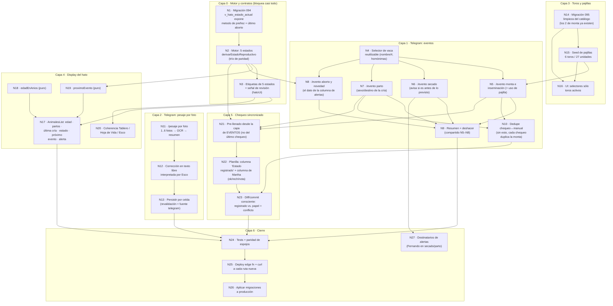

# Plan — Hato Lechero: eventos por Telegram, 5 estados, display y pajillas

**Origen:** visita de campo del dueño a la finca (2026-08-13). Fernando registró en vivo una monta
(vio la vaca en celo y llevó el toro) sin ninguna forma de dejarlo asentado hasta el chequeo
bimensual. De ahí sale todo este alcance.

**Estado del documento:** grafo aprobado y **en ejecución**. Ver §7 (Estado) al final.

> **Grafo cerrado y en producción (2026-08-14).** Los 26 nodos de código están
> hechos, las migraciones 094/095/096 aplicadas, la edge function desplegada y
> el frontend mezclado a `main` (PR #117, desplegado por Vercel).
>
> **N27 ya no existe como tarea**: la migración 096 lo absorbió. Agregar a
> Fernando a `secado_due` y `parto_proximo` era una migración o una edición a
> mano; ahora son dos casillas en Configuración → Telegram. El grafo queda
> **sin nodos abiertos**.
>
> Lo que sigue pendiente NO son nodos sino cierres de campo y una decisión:
> imprimir la planilla, probar `/pesaje` por foto en el corral, y decidir si se
> enciende el escalamiento (que nunca funcionó). Todo en §8.5.

---

## 0. Decisiones del dueño (2026-08-13)

Estas cinco respuestas gobiernan el grafo. Cambiar una cambia la forma del grafo, no sólo un nodo.

| # | Decisión | Consecuencia |
|---|---|---|
| **D-A** | **Toros: borrar los no usados, desactivar los usados.** | `DELETE` físico de los toros del catálogo sin referencias; `activo=false` en los que sí aparecen en `hato_eventos`. Quedan activos únicamente los 2 de monta + los 6 de pajillas. La historia (232 servicios) sobrevive intacta. |
| **D-B** | **Telegram escribe directo**, marcado `fuente='telegram'`. | Sin cola de aprobación. El evento existe apenas Fernando lo registra; Martha lo corrige después desde la Hoja de Vida. Rompe la regla D-7 ("solo Gerencia marca el ciclo") para el canal Telegram — decisión explícita, ver R-3. |
| **D-C** | **Pesaje por foto con corrección en texto libre interpretada por Esco.** | El bot muestra la lectura, Fernando responde en lenguaje natural ("MONZA sem 2 AM son 6.5 y BONITA no se pesó"), Esco traduce a celdas, vuelve a mostrar el resumen y **sólo entonces** persiste. |
| **D-D** | **Cinco estados: vacía · servida · confirmada · por secar · seca.** Servida = preñada por presunción. Confirmada = palpada. | El estado ya no absorbe "aborto/indeterminado": eso vive en una **columna de alertas** aparte que dice qué pasó, y el dato se captura **manualmente**. |
| **D-E** | **La planilla del chequeo sale pre-impresa con lo registrado** (ej. "servida 10/ago, toro X") y al lado va la columna de Martha (ok / rech / nota manuscrita). | El chequeo deja de ser captura en blanco y pasa a ser **verificación de lo registrado**. Es el mecanismo de sincronía: lo que Fernando marcó en agosto llega al papel de la vet en agosto. |

**Nombres de los 2 toros de monta (resuelto 2026-08-13):** los animales todavía no tienen nombre
propio; se quedan como **`Jersey`** y **`Ternero Holstein`**. Ambas filas **ya existen** en
`hato_toros`, así que N14 no crea ninguna (ver N14). No queda ningún dato abierto: el grafo está
listo para ejecutarse completo.

---

## 1. Estado real verificado en producción (2026-08-13)

Todo el grafo está dimensionado contra esto, no contra suposiciones:

- `hato_toros`: **63** filas, **61** activas. **52** están referenciadas por **232** eventos de servicio.
  `hato_animales.padre_toro_id` está poblado en **0** filas.
- `hato_pajillas`: **0** filas. `hato_pajillas_uso`: **0**. *No hay inventario que borrar — sólo sembrar.*
- `hato_eventos`: servicio 412 · parto 300 · aborto 23 · venta 21 · **secado_real 10**. **31** eventos
  tienen `chequeo_vaca_id IS NULL` (manuales, intocables por el commit de chequeo).
- `hato_animales`: **65** activos, de los cuales **45** tienen `fecha_nacimiento` (20 no → la columna
  "Edad" nace con 20 celdas en `—`, nunca en 0).
- `hato_pesajes_leche`: 549 filas.
- **El LAZO ABIERTO documentado en `src/components/hato/CLAUDE.md` está cerrado**: los 5 tipos de
  `hato_alertas_config` ya tienen `destinatario_telegram_id = 8505349717` (Santiago) y están activos.
- Telegram: Fernando Jiménez (`8587641614`) ya existe y está activo, con rol **Administrador**.

---

## 2. El grafo



**Camino crítico:** `N1 → N2 → N21 → N22 → N23 → N24 → N25 → N26`. Todo lo demás cuelga de él o
corre en paralelo.

---

## 3. Especificación por nodo

### Capa 0 — Motor y contratos

**N1 · Migración 094 — la vista expone el método de preñez y el último aborto**
`v_hato_estado_actual` hoy no distingue una confirmación por palpación de una por presunción, y
D-D las separa en dos estados distintos. Agrega dos columnas al final (`CREATE OR REPLACE VIEW` no
reordena): `ultima_confirmacion_prenez_metodo` (`datos->>'metodo'` de la confirmación más reciente)
y `ultimo_aborto_fecha`. Sin esto, N2 no tiene de dónde leer y N3 no tiene qué mostrar en la
columna de alertas.
*Sin dependencias. Bloquea N2.*

**N2 · Motor: los 5 estados**
`derivarEstadoReproductivo` (`src/utils/calculosHato.ts`, **trío protegido por paridad** — cambiar
en las 3 copias en el mismo commit y regenerar con el script, nunca a mano). Reclasificación:

| Hecho | Estado hoy | Estado nuevo |
|---|---|---|
| Servicio sin confirmar | `servida` | **Servida** |
| `confirmacion_prenez` con `metodo='presuncion'` | `preñada` | **Servida** ← cambia |
| `confirmacion_prenez` con `metodo='palpacion'` | `preñada` | **Confirmada** |
| Dentro de la ventana de secado | `proxima_a_secar` | **Por secar** |
| `secado_real` | `seca` | **Seca** |
| Parió y aún no la sirven | `parida_reciente` | **Vacía** (con la fecha de parto al lado) |
| Sin servicio ni confirmación | `vacia_por_servir` | **Vacía** |
| Evento posterior no clasificable | `indeterminado` | **no es un estado** → señal de revisión (N3) |

Trampa documentada que aplica aquí: `ultimo_evento_fecha` es `MAX(fecha)` sobre **toda** la tabla,
así que un `aborto` o un `celo` con fecha de hoy tira la vaca a `indeterminado`. Por eso N8
(registrar aborto desde Telegram) **depende de este nodo**: hay que decidir en el mismo commit
cómo trata el motor ese evento, o Fernando registrando un aborto rompería el estado de la vaca.
*Depende de N1. Bloquea N3, N8, N19, N21.*

**N3 · Etiquetas y señal de revisión**
`hatoUi.chipEstadoReproductivo` pasa a devolver las 5 etiquetas. Nueva función pura
`senalRevisionHato(fila)` → `{ tipo: 'aborto' | 'evento_posterior' | 'sin_datos', texto }` que
alimenta la columna de alertas de N17. Nunca se disfraza de estado.
*Depende de N2. Bloquea N17, N20.*

### Capa 1 — Telegram: eventos

**N4 · Selector de vaca reutilizable**
Búsqueda por nombre o chapeta, con desambiguación explícita de homónimas (el módulo ya sufrió el
caso MOCA #177/#183). Es la pieza compartida por N5–N8; construirla una vez evita cuatro variantes
que se desincronizan.
*Sin dependencias. Bloquea N5–N8.*

**N5 · `/evento` monta e inseminación**
`hato_eventos` tipo `servicio`, `tipo_servicio` `monta`|`inseminacion` (ambos ya en el CHECK),
`toro_id` del catálogo activo, `fuente='telegram'`. Si es inseminación con pajilla, registra además
`hato_pajillas_uso` contra el lote correspondiente (la vista de stock ya descuenta por uso).
`created_by` se setea **explícito** desde `telegram_usuarios.usuario_id` — el bot escribe con
service_role, donde `auth.uid()` es NULL.
*Depende de N4 y N15 (el selector de toro debe ofrecer 8 toros, no 63).*

**N6 · `/evento` secado**
`secado_real`. Compara la fecha contra la `fecha_secar` derivada por el motor y, si es
apreciablemente antes, lo dice en el resumen ("estás secando 5 semanas antes de lo previsto") sin
bloquear — es exactamente el caso de las 2 vacas de baja producción. Advertir, nunca bloquear:
regla general del módulo.
*Depende de N4.*

**N7 · `/evento` parto**
`parto` + `cria_destino`. Reusa el vocabulario que ya existe (`retenida`, `macho_vendido`,
`hembra_vendida`, `muerta`, `aborto`).
*Depende de N4.*

**N8 · `/evento` aborto y novedad**
Es la mitad que hace verdadera la columna de alertas de D-D: hoy un aborto entra sólo por la
planilla y deja la vaca en `indeterminado` sin explicación. Registrado a mano, la columna dice
"aborto 12/ago" en vez de un estado roto.
*Depende de N4 y **N2**.*

**N9 · Resumen y deshacer**
Cada registro responde con el resumen de lo guardado y un botón "deshacer" que borra el evento
recién creado. Es lo que hace tolerable escribir directo (D-B) sin cola de aprobación.
*Depende de N5–N8.*

**N10 · Dedupe chequeo ↔ evento manual**
El nodo que más silenciosamente puede romper todo. El commit del chequeo (`fn_hato_commit_chequeo`,
migración 065) deduplica servicios contra `seleccionarFechasServicioConocidasPorAnimal` y partos
contra `ultimaCriaAnterior`, y **ambas fuentes leen únicamente `hato_chequeo_vacas`**. La monta que
Fernando registre el 10/ago no está ahí, así que al aprobar el chequeo del 20/ago el sistema
generaría un **segundo** evento de servicio para la misma monta — el mismo bug que ya costó tres
rondas de limpieza en julio (385 servicios y 806 partos duplicados). Hay que extender ambos
lados a leer también `hato_eventos` con `chequeo_vaca_id IS NULL`.
*Depende de N5 y N7. Bloquea N23.*

### Capa 2 — Telegram: pesaje por foto

**N11 · `/pesaje` por foto**
Reemplaza la conversación actual vaca-por-vaca (256 líneas iterando 65 animales por chat: inviable
en el corral). Acepta 1..6 fotos, igual que la ruta web — la planilla real se fotografía por
franjas porque 35 filas en una toma salen ilegibles. La lógica de OCR ya está espejada en el árbol
Deno (`importHato/ocrPesaje.ts`): **no se escribe un segundo lector**.
*Sin dependencias.*

**N12 · Corrección en texto libre (D-C)**
El bot muestra la lectura en texto plano; Fernando confirma o describe el error en lenguaje
natural. Esco traduce a celdas concretas, vuelve a mostrar el resumen corregido, y sólo persiste
tras un "ok" explícito. Nada se escribe antes de esa confirmación.
*Depende de N11.*

**N13 · Persistencia por celda**
Reusa la revalidación de `hato-pesaje-commit.ts` (la vaca sigue en el roster, la fecha sigue siendo
una ocurrencia real del día de pesaje). Commit **por celda**, no todo-o-nada: una celda inválida se
rechaza sola. `fuente='telegram'`, `created_by` explícito.
*Depende de N12.*

### Capa 3 — Toros y pajillas

**N14 · Migración 095 — limpieza del catálogo (D-A)**
Guardada igual que 075/080/081: `RAISE EXCEPTION` si los conteos previos y posteriores no cuadran
exactamente, y respaldo en el esquema **`respaldos`**, nunca en `public` (lección de la alerta
crítica del linter del 2026-08-03). `DELETE` de los toros sin referencias en `hato_eventos` /
`hato_animales`; `activo=false` en los referenciados.

**No da de alta ningún toro de monta: los dos ya existen** (verificado en producción 2026-08-13).

| Fila | raza | tipo | activo hoy | eventos | Qué hace N14 |
|---|---|---|---|---|---|
| `Jersey` | Jersey | monta | sí | **44** | **Nada** — ya está exactamente como se necesita. Excepción explícita a la regla "desactivar los referenciados". |
| `Ternero Holstein` | Holstein | monta | **no** | 0 | **Reactivar** (`activo=true`). |
| `Holstein` *(histórico)* | — | — | sí | **48** | **Desactivar**, como cualquier otro referenciado. |

La tercera fila es la trampa de este nodo. `Holstein` a secas viene de la importación histórica,
donde la planilla escribía sólo la raza cuando el toro no tenía nombre (`parseToro` canonicaliza
`hol/hols/HOLST/…` a un único "Holstein"). **No se fusiona con `Ternero Holstein`**: no hay forma
de saber cuáles de esos 48 servicios corresponden a este ternero, y fusionar sería inventar
historia. Mismo criterio que la regla del módulo "dos nombres en la misma hoja son dos animales,
nunca un rename".

Consecuencia para el índice único: `hato_toros` tiene `UNIQUE (lower(nombre))`, así que un
`INSERT` de "Jersey" o "Ternero Holstein" habría fallado con `23505`. La migración usa
**SELECT-or-UPDATE por id**, nunca un upsert de PostgREST — mismo patrón que ya usa `PajillasView`.
*Sin dependencias. Bloquea N15 y N16.*

**N15 · Seed de pajillas**
6 toros `tipo='inseminacion'` + sus lotes en `hato_pajillas`, **27 unidades en total**:

| Toro | Raza | Pajillas |
|---|---|---|
| Matt | Jersey | 7 |
| Daily Double | Jersey | 5 |
| Ulozon | Normando | 3 |
| Hecker | Holstein | 1 |
| Márquez | Holstein | 1 |
| Valentino | Simental | 10 |

*Depende de N14. Bloquea N5 y N16.*

**N16 · UI de toros y pajillas**
Los selectores (Telegram y web) ofrecen sólo `activo=true`, con raza y tipo visibles. El catálogo
completo sigue consultable para leer la historia.
*Depende de N14 y N15.*

### Capa 4 — Display del hato

**N17 · Columnas nuevas en `AnimalesList`**
Orden pedido: **N.º · Nombre · Edad (años) · # Partos · Última cría · Estado (5) · Próximo evento ·
Alerta · Producción**. Sin fecha de nacimiento → `—`, nunca 0 ni una edad inventada (20 de 65
activos hoy).
*Depende de N3, N18, N19.*

**N18 · `edadEnAnios` (puro)**
Años con un decimal, o `null`. Nodo trivial y sin dependencias: se puede hacer primero.

**N19 · `proximoEvento` (puro)**
El más cercano entre parto probable, secado, rechequeo y "servir", con los días que faltan. El motor
ya calcula las cuatro fechas; este nodo sólo elige y rotula.
*Depende de N2.*

**N20 · Coherencia del resto del módulo**
`HatoReproCard`, `VacasPorEstadoCard`, `hatoCategorias.ts` y **las dos copias de
`hato-aggregation.ts`** (Esco) tienen que hablar el mismo vocabulario. La regla del módulo es dura:
la UI y Esco nunca pueden dar conteos distintos de lo mismo.
*Depende de N3.*

### Capa 5 — Chequeo sincronizado (D-E)

**N21 · Pre-llenado desde la capa de eventos**
La planilla **ya es incremental** (arrastra Fecha Servicio, Toro, Estado). Lo que falta es que esos
valores vengan de `hato_eventos` — incluyendo los manuales de Telegram — y no del último chequeo.
Ese es el mecanismo completo de sincronía que pediste: la monta del 10/ago aparece impresa en el
papel del chequeo del 20/ago para que la vet la verifique.
*Depende de N2, N5, N7.*

**N22 · Columnas nuevas de la planilla**
Una columna **"Estado registrado"** (pre-impresa, gris: lo que el sistema cree) y al lado la
**columna de Martha** (blanca: ok / rech / nota manuscrita). Toca `ENCABEZADOS_PLANILLA_CHEQUEO`,
`COLUMNAS_A_DILIGENCIAR`, los alias del parser en `grilla.ts`, `parseEstado` y el prompt del OCR.
Regla dura: los alias **se agregan**, nunca se reemplazan — el parser tiene que seguir leyendo las
3 generaciones históricas de planillas.
*Depende de N21.*

**N23 · Diff y commit conscientes del estado registrado**
La fila del diff muestra "registrado vs. papel" y marca conflicto explícito cuando difieren. El
evento manual nunca se pisa (ya lo garantiza `chequeo_vaca_id IS NULL`), pero la contradicción se
ve antes de aprobar.
*Depende de N22 y N10.*

### Capa 6 — Cierre

- **N24 · Tests.** Paridad del trío `calculosHato` + espejos de `importHato` + `hatoAlertas`;
  tests puros nuevos de N18/N19/N3; round-trip de la planilla (N22).
- **N25 · Deploy + `curl` a cada ruta nueva.** Un `404 Not Found` en texto plano significa que el
  deploy no incluyó la ruta — es literalmente el incidente del 2026-08-11.
- **N26 · Aplicar N1, N14 y N15 a producción**, verificadas contra el catálogo vivo.
- **N27 · Destinatarios de alertas.** Hoy las 5 alertas van sólo a Santiago. Agregar a Fernando en
  `secado_due` y `parto_proximo` cierra el circuito con el flujo manual de N6. Es configuración, no
  código.

---

## 4. Olas de ejecución (paralelizable)

| Ola | Nodos | Notas |
|---|---|---|
| 1 | N1 · N4 · N11 · N18 · N14 | Cinco frentes sin dependencias entre sí. Nada bloqueado: los 2 toros de monta ya existen en el catálogo. |
| 2 | N2 · N5 · N6 · N7 · N8 · N12 · N15 | N2 es el cuello de botella real del grafo. |
| 3 | N3 · N9 · N10 · N13 · N16 · N19 | |
| 4 | N17 · N20 · N21 | |
| 5 | N22 · N23 | La rama más delicada: toca el parser de las planillas históricas. |
| 6 | N24 · N25 · N26 · N27 | |

---

## 5. Riesgos

| # | Riesgo | Mitigación |
|---|---|---|
| **R-1** | N2 toca el motor protegido por paridad byte-idéntica en 3 copias, y cambia conteos que Esco también reporta. | Regenerar los espejos con el script (nunca editar a mano) y correr la paridad antes de tocar UI. |
| **R-2** | Un `aborto` o `celo` con fecha de hoy tira la vaca a `indeterminado` — la trampa que el módulo ya documenta. | N8 depende de N2 por eso: se decide el tratamiento del evento en el mismo commit que lo habilita. |
| **R-3** | D-B contradice D-7 ("sólo Gerencia marca el ciclo"): Fernando es Administrador y escribe directo por Telegram. | Decisión explícita del dueño. Se mitiga con `fuente='telegram'`, `created_by` real, el deshacer de N9 y la corrección de Martha en la Hoja de Vida. La RLS de la app no cambia. |
| **R-4** | Sin N10, cada chequeo duplica silenciosamente lo que Fernando registró — el bug más caro que ya tuvo este módulo. | N10 va en la misma ola que los flujos que lo causan, no después. |
| **R-5** | Cambiar los encabezados de la planilla puede romper la lectura de planillas históricas. | Alias aditivos + el test de round-trip existente. |
| **R-6** | El bot escribe con service_role: `auth.uid()` es NULL, así que ni los triggers de `created_by` ni la traza de `hato_correcciones` se disparan. | `created_by` explícito desde `telegram_usuarios.usuario_id` en todos los nodos de escritura (N5–N8, N13). |

---

## 6. Lo que este alcance NO incluye

- No se toca la contabilidad ni ninguna ruta de `fin_*`.
- No se reintroduce `PesajeSemanalGrid.tsx` (código muerto deliberado); N11–N13 son el camino de
  Telegram, y el flujo web de Martha sigue como está.
- No se cambia la RLS del módulo ni el gate de módulos por usuario.
- No se re-ejecuta `load.ts` (backfill único, para siempre).


---

## 7. Estado de ejecución (2026-08-13)

| Nodo | Estado | Notas |
|---|---|---|
| N1 · Migración 094 | ✅ **aplicada 2026-08-14** | 2 columnas nuevas, `security_invoker` intacto, 179 filas. `ultima_confirmacion_prenez_metodo` sale NULL en las 179: ninguna confirmación histórica trae método, y el motor las lee como PRESUNCIÓN (es lo que dice la cabecera de la migración). 7 animales traen `ultimo_aborto_fecha`. |
| N2 · Motor de 5 estados | ✅ | Espejos regenerados. Un test atrapó que la proyección "quedará" del diálogo no llevaba el método. |
| N3 · Etiquetas + señal | ✅ | `chipEstadoReproductivo` (5 etiquetas) + `chipSenalRevision`. |
| N4–N9 · `/evento` en Telegram | ✅ | Monta · inseminación · secado · parto · aborto, con Deshacer. Gateado por el módulo `hato_produccion`, que Fernando ya tiene. |
| N10 · Dedupe chequeo↔manual | ✅ | `fusionarEventosManualesEnDedupe`, 7 tests. |
| N11–N13 · Pesaje por foto en Telegram | ✅ **2026-08-14** | Pipeline extraído a `hato-pesaje-pipeline.ts`, compartido por el endpoint HTTP y el bot. Corrección en texto libre con "ok" explícito antes de escribir; nunca se adivina vaca, semana ni AM/PM. Commit por celda. La guarda "sin dato nunca es 0" verificada en los DOS caminos. |
| N14–N15 · Toros y pajillas | ✅ **aplicada 2026-08-14** | 8 activos / 57 totales, 6 lotes / 27 unidades, 0 eventos huérfanos, Jersey conserva sus 44 servicios, respaldo de 63 filas en `respaldos`. **La primera ejecución abortó por un bug real de la migración** — ver §8.4. |
| N16 · UI de selectores | ✅ ya cumplido | `PajillaCompraDialog` ya filtra por `activo`; no hizo falta cambio. |
| N17–N20 · Display del hato | ✅ | Edad · Partos · Estado · Señal · Última cría · Próximo evento. |
| N21–N23 · Planilla del chequeo | ✅ **2026-08-14** | N21 ya estaba cumplido: el pre-llenado de Fecha Servicio/Toro ya salía de `hato_eventos` vía la vista. Se agrega la columna "Estado registrado" y `conflictoEstadoRegistrado` en el diff. El reparto del PDF se rehízo DOS veces con el dueño a la vista del render (letra 11->9pt, y `Sexo cría` imprimiendo sólo el sexo). **Falta imprimirla en papel** — ver §8.5. |
| N24 · Tests | ✅ | 2.182 en verde, 0 errores de lint, `tsc` limpio, los 4 generadores de espejos en sincronía. |
| N25 · Deploy | ✅ **2026-08-14** | Desplegada después de las migraciones (el orden importa: el tick pide las columnas de 094). `/health` → 200. |
| N26 · Aplicar migraciones | ✅ **2026-08-14** | 094 y 095, verificadas contra el catálogo vivo. |
| N27 · Destinatarios de alertas | ✅ **absorbido por la migración 096 (2026-08-14)** | Dejó de ser una tarea: `alertas_catalogo` + `telegram_alertas_suscripciones` hacen que "quién recibe qué" sea una casilla por usuario y por tipo, para cualquier módulo. Agregar a Fernando ya no requiere migración ni código. |


---

## 8. Arranque de la sesión LOCAL (handoff)

Esta sección existe para que una sesión nueva, sin el contexto de la que
escribió el código, pueda continuar sin volver a decidir nada.

**Rama:** `claude/telegram-workflows-herd-management-g7ffm6` (7 commits, sin PR).

### 8.1 Lo primero: aplicar y desplegar, en este orden — ✅ HECHO (2026-08-14)

El orden importa. El tick de alertas (`hato-alertas-tick.ts`) ya pide las dos
columnas nuevas en su `SELECT` explícito: si la función se despliega antes de
que exista la vista, el cron de las 05:45 falla. Se respetó: 094 → 095 → deploy.

**Cómo se aplicaron, para la próxima vez.** El conector de Supabase de la sesión
es **solo-lectura** (`cannot execute CREATE VIEW in a read-only transaction`, y
su lista de herramientas no trae `apply_migration`). La ruta que sí escribe, sin
contraseña de base de datos y sin `psql`, es el CLI contra la **Management API**:

```bash
npx supabase db query --linked --project-ref ywhtjwawnkeqlwxbvgup \
  -f src/sql/migrations/094_hato_estado_actual_metodo_prenez_aborto.sql
```

`--linked` es obligatorio junto a `--project-ref` (solos se rechazan entre sí).
El token vive en el llavero de macOS, no en `~/.supabase/`. Sigue vigente el
aviso: **nunca `supabase db push`** — el repo versiona en `src/sql/migrations/`,
que el CLI no mira.

Para ensayar una migración destructiva sin escribir, copiarla cambiando el
`COMMIT;` final por `ROLLBACK;` y correrla igual: las guardas se ejecutan
completas contra datos vivos. Es lo que confirmó los 8/57 antes del pase real.

**Verificación después de aplicar** (read-only, se puede hacer desde cualquier
sesión). Todas dieron el valor esperado:

```sql
-- 094
select count(*) from information_schema.columns
 where table_name = 'v_hato_estado_actual'
   and column_name in ('ultima_confirmacion_prenez_metodo','ultimo_aborto_fecha');  -- 2

-- 095
select count(*) filter (where activo) as activos, count(*) as total from hato_toros;  -- 8 / 57
select count(*) as lotes, sum(cantidad_inicial) as unidades from hato_pajillas;       -- 6 / 27
select count(*) from hato_eventos e
 where e.toro_id is not null
   and not exists (select 1 from hato_toros t where t.id = e.toro_id);                -- 0
```

**Verificación del bot:** escribir `/evento` en Telegram y ver que aparezca el
menú de 5 tipos. No hay ruta HTTP nueva que probar con `curl` — este cambio
agrega un comando del bot, no un endpoint. **Esto es lo único de §8.1 que queda
sin confirmar**: requiere un humano en Telegram. Lo que sí se verificó desde
aquí es que la función quedó desplegada y viva (`/health` → 200) y que
`eventoHato` está registrado en el árbol que se subió.

### 8.2 Lo que quedaba por construir — ✅ HECHO (2026-08-14)

Ambos bloques construidos, verificados y desplegados. `npm test` 2.185 en verde,
0 errores de lint, `tsc --noEmit` limpio, los 4 generadores de espejos en
sincronía, y las rutas nuevas responden 401 (piden auth), no 404 — que es la
verificación que pide N25 tras el incidente del 2026-08-11.

- **N11–N13 · Pesaje por foto.** El pipeline salió de `hato-pesaje-foto.ts` a
  `hato-pesaje-pipeline.ts`, compartido por el endpoint HTTP y el bot. Se
  conserva un solo lector de celdas. La corrección en texto libre exige vaca +
  semana + (AM/PM o "ambos") explícitos: si el modelo no puede extraer alguno de
  los tres, la corrección se reporta como no entendida en vez de adivinarse —
  extensión directa de la regla "nunca adivines la vaca" a los otros dos ejes.
  **`/pesaje` cambia de forma para quien lo usa**: deja de ser vaca-por-vaca
  semanal y pasa a ser foto de la planilla mensual.
- **N21–N23 · Planilla del chequeo.** N21 ya estaba cumplido sin que el plan lo
  supiera (ver la tabla de §7). Lo que faltaba de verdad era exponer el estado
  derivado y detectar la contradicción, que es lo que se construyó.

### 8.3 Cerrado — el frontend YA está en producción (2026-08-14)

Esta sección decía que el frontend no llegaba a producción hasta mezclar a
`main`. **Se mezcló**: PR #117, squash `79ff4d4`, y Vercel construyó y desplegó
a Producción a las 19:06Z (estado `success` sobre el commit del merge). La
lista del hato, la planilla del chequeo y las casillas de alertas están vivas.

### 8.4 El bug que atrapó la guarda de la 095 (2026-08-14)

Vale la pena dejarlo escrito porque es exactamente el tipo de error que estas
migraciones existen para no cometer, y porque confirma que la guarda paga.

La primera ejecución abortó con `Migración 095: deberían quedar 8 toros
activos, quedaron 7.` **La transacción entera se revirtió: producción quedó
intacta** (63 toros, 61 activos, 0 pajillas, sin tabla de respaldo).

Causa: `toros_vigentes` guarda dos cosas distintas en dos columnas —
`clave` es **la grafía con la que el toro vive HOY en la base** y `nombre` es
**la grafía final**. Para siete de los ocho coinciden; para uno no:

| clave (en la base) | nombre final |
|---|---|
| `marquez` | `Márquez` |

El paso 4 renombra la fila a `Márquez`. Los pasos 5 y 6 seguían buscando por
`v.clave`, así que a partir del renombre esa fila **ya no respondía a su propia
clave**: `lower(btrim('Márquez'))` es `'márquez'`, con tilde. El paso 6, que
desactiva "todo lo que no sea vigente", desactivaba entonces al toro que el
paso 4 acababa de normalizar. 8 − 1 = 7.

La corrección es comparar contra **las dos grafías** en los pasos 5 y 6:

```sql
NOT EXISTS (SELECT 1 FROM toros_vigentes v
             WHERE lower(btrim(t.nombre)) IN (v.clave, lower(btrim(v.nombre))))
```

Se editó la 095 en vez de escribir una 096 porque **nunca llegó a aplicarse**:
la regla "no modificar migraciones existentes" protege lo que ya corrió en
producción, y aquí no corrió nada. Parchear con una 096 habría dejado en el
repo una migración que nadie puede ejecutar.

Se agregaron además dos guardas, para que el próximo fallo se diagnostique solo:
una que **nombra** al vigente que no quedó activo (en vez de dar un conteo), y
otra que rechaza pajillas colgadas de un toro inactivo — que es la forma en que
este bug se habría manifestado en la UI: stock real e invisible, porque N16
filtra los selectores por `activo`.

### 8.5 Lo que queda abierto (2026-08-14)

Nada de esto bloquea el uso del módulo, pero ninguno se descubre solo.

**1. La planilla impresa no se ha visto en papel.** La 13ª columna ("Estado
registrado") no cabía: los márgenes bajaron de 10mm a 8mm y **Tratamiento se
recortó de 35mm a 22,5mm (−36%)**, que es una columna donde Martha escribe a
mano. El presupuesto quedó en 263,2mm de tabla contra 263,4mm útiles: **0,2mm de
holgura**. Los tests garantizan que no desborda y que 35 filas siguen cabiendo en
2 páginas, pero **no** que sea cómodo escribir en ella. Necesita imprimirse una
vez antes del próximo chequeo. Si Tratamiento quedó corto, el ancho tiene que
salir de otra columna o la planilla necesita otro formato — no hay más margen.

Se agregó un test con **piso imprimible de 8mm** en los márgenes, porque el
presupuesto de ancho existente no podía atrapar esto: `ANCHO_UTIL_CARTA_
HORIZONTAL_MM` se deriva de `MARGENES_PDF_MM`, así que encoger el margen sube el
techo y el test sigue pasando. Era autorreferencial en ese eje.

**2. Dos huecos menores en el diff del chequeo**, dejados a propósito para no
ampliar el alcance:
- `useRevisionChequeo.ts` recalcula el diff en la ventana de corrección pero no
  `estadosRegistrados`, así que editar cualquier campo ahí borra el indicador de
  conflicto hasta que se regenere la vista previa.
- El baseline de "fecha de servicio/toro" en `compararFila` todavía lee sólo
  `hato_chequeo_vacas`, no los eventos. Es cosmético: N10 ya impide el duplicado
  en la ESCRITURA, así que lo peor que pasa es un "cambio" espurio en el diff.

**3. N27 sigue abierto** — es el único nodo del grafo que no se tocó. Agregar a
Fernando como destinatario de `secado_due` y `parto_proximo` cambia a quién le
llegan mensajes de Telegram, así que espera decisión explícita del dueño.

**4. ~~El frontend no está en producción.~~ Resuelto el 2026-08-14** — ver §8.3.

**5. El escalamiento de alertas nunca funcionó.** Descubierto al montar las
suscripciones: `HATO_ALERTAS_ESCALAMIENTO_TELEGRAM_ID` nunca se configuró, así
que desde julio una alerta sin responder a las 48h se marca `escalada` y no le
llega a nadie. La migración 096 dejó `escalamiento=false` en todas las
suscripciones justamente para no encender de refilón una función apagada:
encenderla es marcar la casilla. **Decisión pendiente del dueño.**

**6. `hato_alertas_config.destinatario_telegram_id` quedó vestigial** — el
motor ya no la lee. No se borró: tiene historia, y borrar una columna merece su
propia migración.
