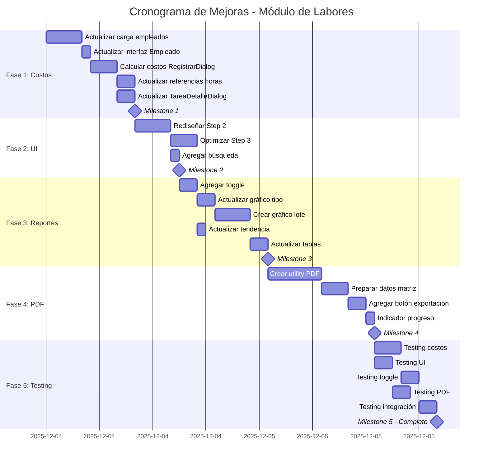

# Plan de Trabajo Detallado: Mejoras al Módulo de Labores

**Fecha de creación:** 4 de diciembre de 2025  
**Versión:** 1.0  
**Estimación total:** 8-11 días laborables  

---

## Resumen Ejecutivo

Este plan detalla las mejoras requeridas para el módulo de labores, enfocándose en:
- Actualización de la lógica de cálculo de costos laborales
- Optimización de UI para equipos grandes (20+ personas)
- Implementación de visualización flexible en reportes (toggle jornales/costos)
- Modificación de gráficos de reportes
- Exportación de reportes en PDF

**Contexto:** Se aprovechan las mejoras recientes en [`TareaDetalleDialog.tsx`](src/components/labores/TareaDetalleDialog.tsx:157) para mantener consistencia en diseño y responsividad.

---

## Fase 1: Actualización de Lógica de Costos (2-3 días)

### Objetivo
Actualizar el cálculo del costo de labores usando los campos completos de empleados desde la base de datos.

### Cambios en la Lógica de Cálculo

**Nueva fórmula:**
```typescript
// Costo por hora = (Salario + Prestaciones + Auxilios) / Horas Semanales
const costoHora = (salario + prestaciones_sociales + auxilios_no_salariales) / horas_semanales;

// Costo por jornal = Costo por Hora × Horas del Jornal × Fracción
// IMPORTANTE: Cambiar de 12 a 8 horas por jornal
const costoJornal = costoHora * 8 * parseFloat(fraccion_jornal);
```

### Tareas Detalladas

#### 1.1 Actualizar Carga de Datos de Empleados (4 horas)
**Archivo:** [`Labores.tsx`](src/components/labores/Labores.tsx:223)

```typescript
// Línea 223 - Actualizar query para incluir nuevos campos
const cargarEmpleados = async () => {
  const { data, error } = await getSupabase()
    .from('empleados')
    .select(`
      id, 
      nombre, 
      cargo, 
      estado, 
      salario,
      prestaciones_sociales,
      auxilios_no_salariales,
      horas_semanales
    `)
    .eq('estado', 'Activo')
    .order('nombre', { ascending: true });
  
  if (error) throw error;
  setEmpleados(data || []);
};
```

**Dependencias:** Ninguna  
**Impacto:** Bajo - Solo lectura de datos

#### 1.2 Actualizar Interfaz Empleado (1 hora)
**Archivo:** [`Labores.tsx`](src/components/labores/Labores.tsx:49)

```typescript
// Línea 49 - Actualizar interfaz Empleado
export interface Empleado {
  id: string;
  nombre: string;
  cargo?: string;
  estado: 'Activo' | 'Inactivo';
  salario?: number;
  prestaciones_sociales?: number;
  auxilios_no_salariales?: number;
  horas_semanales?: number;
}
```

**Dependencias:** Ninguna  
**Impacto:** Bajo - Cambio de tipo

#### 1.3 Actualizar Cálculo en RegistrarTrabajoDialog (3 horas)
**Archivo:** [`RegistrarTrabajoDialog.tsx`](src/components/labores/RegistrarTrabajoDialog.tsx:89)

```typescript
// Línea 89 - Actualizar función calculateCostoJornal
const calculateCostoJornal = (
  empleado: Empleado, 
  fraccion: RegistroTrabajo['fraccion_jornal']
) => {
  const salario = empleado.salario || 0;
  const prestaciones = empleado.prestaciones_sociales || 0;
  const auxilios = empleado.auxilios_no_salariales || 0;
  const horasSemanales = empleado.horas_semanales || 48; // Default 48h semanales
  
  // Costo por hora
  const costoHora = (salario + prestaciones + auxilios) / horasSemanales;
  
  // Costo por jornal (8 horas × fracción)
  return costoHora * 8 * parseFloat(fraccion);
};

// Línea 116 - Actualizar datos del registro
const registrosData = selectedEmpleados.map(se => ({
  tarea_id: tarea.id,
  empleado_id: se.empleado.id,
  fecha_trabajo: fechaTrabajo,
  fraccion_jornal: se.fraccion,
  observaciones: se.observaciones || null,
  valor_jornal_empleado: calculateCostoJornal(se.empleado, '1.0'), // Valor base
  costo_jornal: calculateCostoJornal(se.empleado, se.fraccion),
}));
```

**Dependencias:** 1.1, 1.2  
**Impacto:** Medio - Cambio en lógica de negocio

#### 1.4 Actualizar Referencias de Horas en UI (2 horas)
**Archivos afectados:**
- [`RegistrarTrabajoDialog.tsx`](src/components/labores/RegistrarTrabajoDialog.tsx:142)
- [`ReportesView.tsx`](src/components/labores/ReportesView.tsx:311)

```typescript
// Actualizar opciones de fracción de jornal (línea 142-146)
const fraccionJornalOptions = [
  { value: '0.25', label: '1/4 jornal (2 horas)', horas: 2 },    // Era 3h
  { value: '0.5', label: '1/2 jornal (4 horas)', horas: 4 },     // Era 6h
  { value: '0.75', label: '3/4 jornal (6 horas)', horas: 6 },    // Era 9h
  { value: '1.0', label: '1 jornal completo (8 horas)', horas: 8 }, // Era 12h
];

// ReportesView.tsx línea 311 - Actualizar conversión a horas
<p className="text-xs text-muted-foreground">
  Equivalente a {Math.round(estadisticasGenerales.totalJornales * 8)} horas
</p>
```

**Dependencias:** 1.3  
**Impacto:** Bajo - Cambios cosméticos

#### 1.5 Actualizar Cálculos en TareaDetalleDialog (2 horas)
**Archivo:** [`TareaDetalleDialog.tsx`](src/components/labores/TareaDetalleDialog.tsx:102)

```typescript
// Línea 102 - Actualizar calcularMetricas
const calcularMetricas = () => {
  if (!tarea) return null;

  const jornalesRegistrados = registrosTrabajo.reduce(
    (sum, r) => sum + parseFloat(r.fraccion_jornal), 0
  );
  const jornalesEstimados = tarea.jornales_estimados || 0;
  const progresoJornales = jornalesEstimados > 0 
    ? (jornalesRegistrados / jornalesEstimados) * 100 
    : 0;

  // Costo actual viene directamente de registros_trabajo (ya calculado correctamente)
  const costoActual = registrosTrabajo.reduce(
    (sum, r) => sum + r.costo_jornal, 0
  );
  
  // Costo estimado usando el costo por hora del responsable
  const responsable = empleados.find(e => e.id === tarea.responsable_id);
  let costoEstimado = 0;
  if (responsable) {
    const salario = responsable.salario || 0;
    const prestaciones = responsable.prestaciones_sociales || 0;
    const auxilios = responsable.auxilios_no_salariales || 0;
    const horasSemanales = responsable.horas_semanales || 48;
    const costoHora = (salario + prestaciones + auxilios) / horasSemanales;
    costoEstimado = costoHora * 8 * jornalesEstimados;
  }

  // ... resto del código
};
```

**Dependencias:** 1.1, 1.2, 1.3  
**Impacto:** Medio - Afecta visualización de métricas

### Entregables Fase 1
- [ ] Interfaz Empleado actualizada
- [ ] Carga de datos incluyendo campos de prestaciones y auxilios
- [ ] Función de cálculo de costos actualizada
- [ ] UI con referencias a 8 horas implementadas
- [ ] Métricas en detalle de tarea actualizadas

### Milestone 1: Lógica de Costos Completa
**Criterios de éxito:**
- Cálculos de costo usando nueva fórmula
- Referencias a 8 horas en toda la UI
- Tests manuales con datos de ejemplo verificados

---

## Fase 2: Optimización UI para Equipos Grandes (1-2 días)

### Objetivo
Mejorar la interfaz de registro de trabajo para manejar eficientemente equipos de 20+ personas, inspirándose en las mejoras de [`TareaDetalleDialog.tsx`](src/components/labores/TareaDetalleDialog.tsx:157).

### Análisis de TareaDetalleDialog.tsx

**Elementos a replicar:**
1. **Grid responsivo** (línea 266): `grid-cols-1 md:grid-cols-3 gap-6`
2. **Cards compactas** (línea 197): Padding `px-4 py-3.5 md:p-4`
3. **Truncamiento de texto** (línea 273-275): `truncate` class
4. **Espaciado eficiente** (línea 192): `space-y-6`
5. **ScrollArea** (línea 191): Para contenido largo

### Tareas Detalladas

#### 2.1 Rediseñar Step 2: Selección de Empleados (4 horas)
**Archivo:** [`RegistrarTrabajoDialog.tsx`](src/components/labores/RegistrarTrabajoDialog.tsx:224)

```typescript
{/* Step 2: Select Employees - OPTIMIZADO */}
{currentStep === 2 && (
  <div className="space-y-6">
    <div className="text-center">
      <div className="h-16 w-16 bg-[#73991C]/10 rounded-full flex items-center justify-center mx-auto mb-4">
        <span className="text-2xl">👥</span>
      </div>
      <h3 className="text-xl font-semibold text-gray-900 mb-2">
        Seleccionar Empleados
      </h3>
      <p className="text-gray-600">
        Elija los empleados que trabajaron en esta tarea
      </p>
    </div>

    {/* Barra de búsqueda */}
    <div className="relative">
      <Search className="absolute left-3 top-1/2 transform -translate-y-1/2 h-4 w-4 text-gray-400" />
      <Input
        type="text"
        placeholder="Buscar empleado..."
        value={empleadoSearch}
        onChange={(e) => setEmpleadoSearch(e.target.value)}
        className="pl-10"
      />
    </div>

    {/* Grid compacto inspirado en TareaDetalleDialog */}
    <ScrollArea className="max-h-[400px]">
      <div className="grid grid-cols-1 sm:grid-cols-2 md:grid-cols-3 lg:grid-cols-4 gap-3 pr-4">
        {empleadosFiltrados.map((empleado) => {
          const isSelected = selectedEmpleados.some(se => se.empleado.id === empleado.id);
          return (
            <div
              key={empleado.id}
              onClick={() => isSelected ? removeEmpleado(empleado.id) : addEmpleado(empleado)}
              className={`px-3 py-2.5 border-2 rounded-lg cursor-pointer transition-all hover:shadow-md ${
                isSelected
                  ? 'border-[#73991C] bg-[#73991C]/5'
                  : 'border-gray-200 hover:border-gray-300'
              }`}
            >
              <div className="flex items-start justify-between gap-2">
                <div className="min-w-0 flex-1">
                  <h4 className="font-medium text-sm text-gray-900 truncate">
                    {empleado.nombre}
                  </h4>
                  {empleado.cargo && (
                    <p className="text-xs text-gray-500 truncate mt-0.5">
                      {empleado.cargo}
                    </p>
                  )}
                </div>
                <div className={`w-5 h-5 rounded-full border-2 flex items-center justify-center flex-shrink-0 ${
                  isSelected ? 'border-[#73991C] bg-[#73991C]' : 'border-gray-300'
                }`}>
                  {isSelected && <span className="text-white text-xs">✓</span>}
                </div>
              </div>
            </div>
          );
        })}
      </div>
    </ScrollArea>

    {/* Badge de selección */}
    {selectedEmpleados.length > 0 && (
      <div className="bg-blue-50 px-4 py-3 rounded-lg border border-blue-200">
        <p className="text-sm text-blue-800">
          <strong>{selectedEmpleados.length}</strong> empleado{selectedEmpleados.length !== 1 ? 's' : ''} seleccionado{selectedEmpleados.length !== 1 ? 's' : ''}
        </p>
      </div>
    )}
  </div>
)}
```

**Características clave:**
- Cards 4x más compactas (de ~120px a ~70px altura)
- Grid de 4 columnas en pantallas grandes
- Búsqueda de empleados para filtrado rápido
- ScrollArea para manejar listas largas
- Hover effects para mejor UX

**Dependencias:** Ninguna  
**Impacto:** Alto - Mejora significativa de UX

#### 2.2 Optimizar Step 3: Asignación de Jornales (3 horas)
**Archivo:** [`RegistrarTrabajoDialog.tsx`](src/components/labores/RegistrarTrabajoDialog.tsx:287)

```typescript
{/* Step 3: Assign Jornales - COMPACTO */}
{currentStep === 3 && (
  <div className="space-y-6">
    {/* ... header ... */}
    
    <ScrollArea className="max-h-[500px]">
      <div className="space-y-3 pr-4">
        {selectedEmpleados.map((selectedEmpleado) => (
          <div key={selectedEmpleado.empleado.id} 
               className="bg-gray-50 px-4 py-3 rounded-lg border">
            {/* Header compacto */}
            <div className="flex items-center justify-between mb-3">
              <div className="min-w-0 flex-1">
                <h4 className="font-medium text-sm text-gray-900 truncate">
                  {selectedEmpleado.empleado.nombre}
                </h4>
                {selectedEmpleado.empleado.cargo && (
                  <span className="text-xs text-gray-500 truncate">
                    {selectedEmpleado.empleado.cargo}
                  </span>
                )}
              </div>
              <Button
                type="button"
                variant="ghost"
                size="sm"
                onClick={() => removeEmpleado(selectedEmpleado.empleado.id)}
                className="text-red-600 hover:text-red-700 h-8 w-8 p-0"
              >
                ✕
              </Button>
            </div>

            {/* Grid 2 columnas para fracción y costo */}
            <div className="grid grid-cols-2 gap-3">
              <div className="space-y-1.5">
                <Label className="text-xs">Fracción</Label>
                <Select
                  value={selectedEmpleado.fraccion}
                  onValueChange={(value) => 
                    updateEmpleadoFraccion(selectedEmpleado.empleado.id, value as any)
                  }
                >
                  <SelectTrigger className="h-9">
                    <SelectValue />
                  </SelectTrigger>
                  <SelectContent>
                    {fraccionJornalOptions.map((option) => (
                      <SelectItem key={option.value} value={option.value}>
                        {option.label}
                      </SelectItem>
                    ))}
                  </SelectContent>
                </Select>
              </div>

              <div className="space-y-1.5">
                <Label className="text-xs">Costo</Label>
                <div className="bg-white px-3 h-9 rounded border flex items-center justify-center">
                  <span className="text-sm font-semibold text-[#73991C]">
                    ${calculateCostoJornal(
                      selectedEmpleado.empleado, 
                      selectedEmpleado.fraccion
                    ).toLocaleString()}
                  </span>
                </div>
              </div>
            </div>

            {/* Observaciones colapsables */}
            <details className="mt-3">
              <summary className="text-xs text-gray-600 cursor-pointer hover:text-gray-900">
                Agregar observaciones
              </summary>
              <Textarea
                value={selectedEmpleado.observaciones}
                onChange={(e) => 
                  updateEmpleadoObservaciones(selectedEmpleado.empleado.id, e.target.value)
                }
                placeholder="Observaciones..."
                rows={2}
                className="mt-2 text-sm"
              />
            </details>
          </div>
        ))}
      </div>
    </ScrollArea>

    {/* Resumen compacto */}
    <div className="bg-green-50 px-4 py-3 rounded-lg border border-green-200">
      <div className="grid grid-cols-3 gap-4 text-sm">
        <div>
          <span className="text-green-700 text-xs">Fecha:</span>
          <p className="font-medium">{new Date(fechaTrabajo).toLocaleDateString('es-CO')}</p>
        </div>
        <div>
          <span className="text-green-700 text-xs">Empleados:</span>
          <p className="font-medium">{selectedEmpleados.length}</p>
        </div>
        <div>
          <span className="text-green-700 text-xs">Total:</span>
          <p className="font-bold text-green-700">
            ${selectedEmpleados.reduce((total, se) =>
              total + calculateCostoJornal(se.empleado, se.fraccion), 0
            ).toLocaleString()}
          </p>
        </div>
      </div>
    </div>
  </div>
)}
```

**Mejoras:**
- 40% más compacto (de 350px a 210px por empleado)
- Observaciones colapsables por defecto
- Grid 2 columnas para fracción/costo
- ScrollArea para mejor manejo

**Dependencias:** 2.1  
**Impacto:** Alto - Mejor usabilidad

#### 2.3 Agregar Estado de Búsqueda (1 hora)
**Archivo:** [`RegistrarTrabajoDialog.tsx`](src/components/labores/RegistrarTrabajoDialog.tsx:47)

```typescript
// Agregar estado de búsqueda después de línea 47
const [empleadoSearch, setEmpleadoSearch] = useState('');

// Función de filtrado
const empleadosFiltrados = empleados.filter(emp => 
  emp.nombre.toLowerCase().includes(empleadoSearch.toLowerCase()) ||
  (emp.cargo && emp.cargo.toLowerCase().includes(empleadoSearch.toLowerCase()))
);
```

**Dependencias:** Ninguna  
**Impacto:** Bajo

### Entregables Fase 2
- [ ] Grid compacto de 4 columnas para selección
- [ ] Búsqueda de empleados implementada
- [ ] Cards reducidas a ~70px altura
- [ ] ScrollArea para listas largas
- [ ] Observaciones colapsables
- [ ] Resumen compacto de 3 columnas

### Milestone 2: UI Optimizada
**Criterios de éxito:**
- Selección de 20+ empleados fluida
- Espacio vertical reducido en 40%
- Búsqueda funcional
- Consistencia con TareaDetalleDialog.tsx

---

## Fase 3: Toggle y Modificación de Gráficos (2-3 días)

### Objetivo
Implementar visualización flexible en reportes con toggle jornales/costo y modificar gráfico de distribución por empleado a resumen por lote.

### Tareas Detalladas

#### 3.1 Agregar Toggle Component (2 horas)
**Archivo:** [`ReportesView.tsx`](src/components/labores/ReportesView.tsx:342)

```typescript
// Importar componente Toggle
import { Toggle } from '../ui/toggle';

// Agregar estado después de línea 108
const [vistaMetrica, setVistaMetrica] = useState<'jornales' | 'costo'>('costo');

// Insertar toggle después de las estadísticas generales (después de línea 342)
{/* Toggle de visualización */}
<div className="flex justify-center mb-6">
  <div className="inline-flex items-center gap-3 bg-gray-50 p-1.5 rounded-lg border">
    <button
      onClick={() => setVistaMetrica('jornales')}
      className={`px-4 py-2 rounded-md text-sm font-medium transition-all ${
        vistaMetrica === 'jornales'
          ? 'bg-white text-[#73991C] shadow-sm'
          : 'text-gray-600 hover:text-gray-900'
      }`}
    >
      <Clock className="h-4 w-4 inline-block mr-2" />
      Ver Jornales
    </button>
    <button
      onClick={() => setVistaMetrica('costo')}
      className={`px-4 py-2 rounded-md text-sm font-medium transition-all ${
        vistaMetrica === 'costo'
          ? 'bg-white text-[#73991C] shadow-sm'
          : 'text-gray-600 hover:text-gray-900'
      }`}
    >
      <DollarSign className="h-4 w-4 inline-block mr-2" />
      Ver Costos
    </button>
  </div>
</div>
```

**Dependencias:** Ninguna  
**Impacto:** Bajo - Solo UI

#### 3.2 Actualizar Gráfico de Costos por Tipo (2 horas)
**Archivo:** [`ReportesView.tsx`](src/components/labores/ReportesView.tsx:347)

```typescript
{/* Gráfico 1: Costos/Jornales por Tipo de Tarea */}
<Card>
  <CardHeader>
    <CardTitle className="flex items-center gap-2">
      <BarChart3 className="h-5 w-5" />
      {vistaMetrica === 'costo' ? 'Costos' : 'Jornales'} por Tipo de Tarea
    </CardTitle>
    <CardDescription>
      Distribución de {vistaMetrica === 'costo' ? 'costos laborales' : 'jornales trabajados'} por categoría
    </CardDescription>
  </CardHeader>
  <CardContent>
    <ResponsiveContainer width="100%" height={300}>
      <BarChart data={costosPorTipo}>
        <CartesianGrid strokeDasharray="3 3" />
        <XAxis
          dataKey="tipo"
          angle={-45}
          textAnchor="end"
          height={80}
          fontSize={12}
        />
        <YAxis tickFormatter={
          vistaMetrica === 'costo' ? formatCurrency : formatNumber
        } />
        <Tooltip
          formatter={(value: any) => [
            vistaMetrica === 'costo' ? formatCurrency(value) : formatNumber(value),
            vistaMetrica === 'costo' ? 'Costo' : 'Jornales'
          ]}
        />
        <Bar 
          dataKey={vistaMetrica === 'costo' ? 'costo' : 'jornales'} 
          fill="#73991C" 
        />
      </BarChart>
    </ResponsiveContainer>
  </CardContent>
</Card>
```

**Dependencias:** 3.1  
**Impacto:** Medio

#### 3.3 Crear Gráfico de Resumen por Lote (4 horas)
**Archivo:** [`ReportesView.tsx`](src/components/labores/ReportesView.tsx:238)

```typescript
// Agregar procesamiento de datos por lote después de línea 236
// Costos/Jornales por Lote
const costosLoteMap = new Map<string, { costo: number; jornales: number; tareas: Set<string> }>();

registros.forEach(registro => {
  // Obtener lote desde la tarea
  const loteId = registro.tareas?.lote_id;
  const loteNombre = loteId 
    ? lotes.find(l => l.id === loteId)?.nombre || 'Sin lote'
    : 'Sin lote';

  if (!costosLoteMap.has(loteNombre)) {
    costosLoteMap.set(loteNombre, { costo: 0, jornales: 0, tareas: new Set() });
  }

  const data = costosLoteMap.get(loteNombre)!;
  data.costo += Number(registro.costo_jornal) || 0;
  data.jornales += Number(registro.fraccion_jornal) || 0;
  data.tareas.add(registro.tarea_id);
});

const costosLoteArray = Array.from(costosLoteMap.entries()).map(([lote, data]) => ({
  lote,
  costo: data.costo,
  jornales: data.jornales,
  tareas: data.tareas.size,
})).sort((a, b) => b.costo - a.costo);

setCostosPorLote(costosLoteArray);

// Reemplazar gráfico de empleados con gráfico de lotes (línea 379-411)
{/* Gráfico 2: Distribución por Lote */}
<Card>
  <CardHeader>
    <CardTitle className="flex items-center gap-2">
      <BarChart3 className="h-5 w-5" />
      {vistaMetrica === 'costo' ? 'Costos' : 'Jornales'} por Lote
    </CardTitle>
    <CardDescription>
      Distribución de {vistaMetrica === 'costo' ? 'costos' : 'jornales'} por ubicación
    </CardDescription>
  </CardHeader>
  <CardContent>
    <ResponsiveContainer width="100%" height={300}>
      <BarChart data={costosLoteArray}>
        <CartesianGrid strokeDasharray="3 3" />
        <XAxis
          dataKey="lote"
          angle={-45}
          textAnchor="end"
          height={80}
          fontSize={12}
        />
        <YAxis tickFormatter={
          vistaMetrica === 'costo' ? formatCurrency : formatNumber
        } />
        <Tooltip
          formatter={(value: any) => [
            vistaMetrica === 'costo' ? formatCurrency(value) : formatNumber(value),
            vistaMetrica === 'costo' ? 'Costo' : 'Jornales'
          ]}
        />
        <Bar 
          dataKey={vistaMetrica === 'costo' ? 'costo' : 'jornales'} 
          fill="#E74C3C" 
        />
      </BarChart>
    </ResponsiveContainer>
  </CardContent>
</Card>
```

**Dependencias:** 3.1, 3.2  
**Impacto:** Alto - Cambio de gráfico

#### 3.4 Actualizar Gráfico de Tendencia (1 hora)
**Archivo:** [`ReportesView.tsx`](src/components/labores/ReportesView.tsx:414)

```typescript
<Card className="lg:col-span-2">
  <CardHeader>
    <CardTitle className="flex items-center gap-2">
      <Activity className="h-5 w-5" />
      Tendencia de {vistaMetrica === 'costo' ? 'Costos' : 'Jornales'} Diarios
    </CardTitle>
    <CardDescription>
      Evolución {vistaMetrica === 'costo' ? 'de los costos laborales' : 'de jornales trabajados'} en el período
    </CardDescription>
  </CardHeader>
  <CardContent>
    <ResponsiveContainer width="100%" height={300}>
      <AreaChart data={tendenciaCostos}>
        <CartesianGrid strokeDasharray="3 3" />
        <XAxis dataKey="fecha" />
        <YAxis tickFormatter={
          vistaMetrica === 'costo' ? formatCurrency : formatNumber
        } />
        <Tooltip
          formatter={(value: any) => [
            vistaMetrica === 'costo' ? formatCurrency(value) : formatNumber(value),
            vistaMetrica === 'costo' ? 'Costo' : 'Jornales'
          ]}
        />
        <Area
          type="monotone"
          dataKey={vistaMetrica === 'costo' ? 'costo' : 'jornales'}
          stroke="#73991C"
          fill="#73991C"
          fillOpacity={0.6}
        />
      </AreaChart>
    </ResponsiveContainer>
  </CardContent>
</Card>
```

**Dependencias:** 3.1  
**Impacto:** Medio

#### 3.5 Actualizar Tablas de Detalle (2 horas)
**Archivo:** [`ReportesView.tsx`](src/components/labores/ReportesView.tsx:452)

```typescript
{/* Tabla por Tipo - Con toggle */}
<Card>
  <CardHeader>
    <CardTitle>Detalle por Tipo de Tarea</CardTitle>
    <CardDescription>
      {vistaMetrica === 'costo' ? 'Costos' : 'Jornales'} desglosados por categoría
    </CardDescription>
  </CardHeader>
  <CardContent>
    <Table>
      <TableHeader>
        <TableRow>
          <TableHead>Tipo</TableHead>
          <TableHead className="text-right">
            {vistaMetrica === 'costo' ? 'Costo' : 'Jornales'}
          </TableHead>
          <TableHead className="text-right">Tareas</TableHead>
        </TableRow>
      </TableHeader>
      <TableBody>
        {costosPorTipo.map((item, index) => (
          <TableRow key={index}>
            <TableCell className="font-medium">{item.tipo}</TableCell>
            <TableCell className="text-right font-semibold">
              {vistaMetrica === 'costo' 
                ? formatCurrency(item.costo)
                : formatNumber(item.jornales)
              }
            </TableCell>
            <TableCell className="text-right">{item.tareas}</TableCell>
          </TableRow>
        ))}
      </TableBody>
    </Table>
  </CardContent>
</Card>

{/* Tabla por Lote - Nueva */}
<Card>
  <CardHeader>
    <CardTitle>Detalle por Lote</CardTitle>
    <CardDescription>
      {vistaMetrica === 'costo' ? 'Costos' : 'Jornales'} desglosados por ubicación
    </CardDescription>
  </CardHeader>
  <CardContent>
    <Table>
      <TableHeader>
        <TableRow>
          <TableHead>Lote</TableHead>
          <TableHead className="text-right">
            {vistaMetrica === 'costo' ? 'Costo' : 'Jornales'}
          </TableHead>
          <TableHead className="text-right">Tareas</TableHead>
        </TableRow>
      </TableHeader>
      <TableBody>
        {costosLoteArray.map((item, index) => (
          <TableRow key={index}>
            <TableCell className="font-medium">{item.lote}</TableCell>
            <TableCell className="text-right font-semibold">
              {vistaMetrica === 'costo' 
                ? formatCurrency(item.costo)
                : formatNumber(item.jornales)
              }
            </TableCell>
            <TableCell className="text-right">{item.tareas}</TableCell>
          </TableRow>
        ))}
      </TableBody>
    </Table>
  </CardContent>
</Card>
```

**Dependencias:** 3.3  
**Impacto:** Medio

### Entregables Fase 3
- [ ] Toggle jornales/costo implementado
- [ ] Gráfico por tipo responsive al toggle
- [ ] Gráfico por lote creado (reemplaza empleados)
- [ ] Gráfico de tendencia responsive al toggle
- [ ] Tablas actualizadas con toggle
- [ ] Tabla de registro detallado sin cambios (como requerido)

### Milestone 3: Reportes Mejorados
**Criterios de éxito:**
- Toggle funcional entre jornales y costos
- Todos los gráficos responden al toggle
- Nuevo gráfico por lote implementado
- Tabla detallada permanece sin cambios

---

## Fase 4: Exportación a PDF (2-3 días)

### Objetivo
Implementar exportación de reportes en formato PDF con diseño profesional de 2 páginas.

### Decisión Técnica: jsPDF + autoTable
**Librería seleccionada:** jsPDF con plugin jspdf-autotable
**Razones:**
- Amplia documentación y comunidad
- Soporte nativo para tablas con autoTable
- Tamaño de bundle pequeño (~100KB)
- Control fino sobre diseño
- Compatible con React

**Instalación:**
```bash
npm install jspdf jspdf-autotable
npm install --save-dev @types/jspdf
```

### Estructura del PDF

#### Página 1: Registro Detallado
```
┌─────────────────────────────────────────┐
│  Logo/Header                             │
│  REPORTE DE LABORES                      │
│  Período: DD/MM/YYYY - DD/MM/YYYY       │
├─────────────────────────────────────────┤
│                                          │
│  REGISTRO DETALLADO DE TRABAJO          │
│  ┌────────────────────────────────────┐ │
│  │ Fecha | Empleado | Tarea | ... │  │ │
│  │───────────────────────────────────│   │
│  │ ...                              │   │
│  │ ...                              │   │
│  └────────────────────────────────────┘ │
│                                          │
│  Total: XX jornales | $XXX,XXX         │
└─────────────────────────────────────────┘
```

#### Página 2: Matriz Actividades × Lotes
```
┌─────────────────────────────────────────┐
│  MATRIZ DE JORNALES POR ACTIVIDAD Y LOTE│
├─────────────────────────────────────────┤
│             │ Lote 1 │ Lote 2 │ Total  │
│─────────────┼────────┼────────┼────────│
│ Actividad 1 │ 12.5 j │  8.0 j │ 20.5 j │
│             │ $XXX   │ $XXX   │ $XXX   │
│─────────────┼────────┼────────┼────────│
│ Actividad 2 │ 15.0 j │ 10.5 j │ 25.5 j │
│             │ $XXX   │ $XXX   │ $XXX   │
│─────────────┼────────┼────────┼────────│
│ TOTAL       │ 27.5 j │ 18.5 j │ 46.0 j │
│             │ $XXX   │ $XXX   │ $XXX   │
└─────────────────────────────────────────┘
```

### Tareas Detalladas

#### 4.1 Crear Utility para Generación de PDF (6 horas)
**Archivo:** `src/utils/generarPDFLabores.ts` (nuevo)

```typescript
import jsPDF from 'jspdf';
import autoTable from 'jspdf-autotable';

interface RegistroDetalle {
  fecha: string;
  empleado: string;
  tarea: string;
  tipo: string;
  fraccion: number;
  costo: number;
}

interface MatrizData {
  actividad: string;
  lotes: { [loteNombre: string]: { jornales: number; costo: number } };
  totalJornales: number;
  totalCosto: number;
}

export const generarPDFLabores = async (
  fechaInicio: string,
  fechaFin: string,
  registros: RegistroDetalle[],
  matrizData: MatrizData[]
) => {
  const doc = new jsPDF({ orientation: 'landscape', format: 'a4' });
  
  // Colores de la paleta
  const primaryColor = [115, 153, 28]; // #73991C
  const secondaryColor = [90, 119, 22]; // #5a7716
  const accentColor = [231, 76, 60]; // #E74C3C
  
  // ===== PÁGINA 1: REGISTRO DETALLADO =====
  
  // Header
  doc.setFillColor(...primaryColor);
  doc.rect(0, 0, doc.internal.pageSize.width, 40, 'F');
  
  doc.setTextColor(255, 255, 255);
  doc.setFontSize(24);
  doc.setFont('helvetica', 'bold');
  doc.text('REPORTE DE LABORES', 20, 20);
  
  doc.setFontSize(12);
  doc.setFont('helvetica', 'normal');
  doc.text(
    `Período: ${new Date(fechaInicio).toLocaleDateString('es-CO')} - ${new Date(fechaFin).toLocaleDateString('es-CO')}`,
    20,
    30
  );
  
  // Tabla de registros detallados
  doc.setTextColor(0, 0, 0);
  doc.setFontSize(14);
  doc.setFont('helvetica', 'bold');
  doc.text('REGISTRO DETALLADO DE TRABAJO', 20, 55);
  
  const totalJornales = registros.reduce((sum, r) => sum + r.fraccion, 0);
  const totalCosto = registros.reduce((sum, r) => sum + r.costo, 0);
  
  autoTable(doc, {
    startY: 60,
    head: [['Fecha', 'Empleado', 'Tarea', 'Tipo', 'Jornales', 'Costo']],
    body: registros.map(r => [
      new Date(r.fecha).toLocaleDateString('es-CO'),
      r.empleado,
      r.tarea,
      r.tipo,
      r.fraccion.toFixed(2),
      `$${r.costo.toLocaleString('es-CO')}`
    ]),
    foot: [[
      'TOTAL',
      '',
      '',
      '',
      totalJornales.toFixed(2),
      `$${totalCosto.toLocaleString('es-CO')}`
    ]],
    theme: 'grid',
    headStyles: {
      fillColor: primaryColor,
      textColor: [255, 255, 255],
      fontStyle: 'bold',
      fontSize: 10
    },
    footStyles: {
      fillColor: secondaryColor,
      textColor: [255, 255, 255],
      fontStyle: 'bold',
      fontSize: 10
    },
    styles: {
      fontSize: 9,
      cellPadding: 3
    },
    alternateRowStyles: {
      fillColor: [245, 245, 245]
    },
    margin: { left: 20, right: 20 }
  });
  
  // ===== PÁGINA 2: MATRIZ =====
  doc.addPage();
  
  // Header página 2
  doc.setFillColor(...primaryColor);
  doc.rect(0, 0, doc.internal.pageSize.width, 40, 'F');
  
  doc.setTextColor(255, 255, 255);
  doc.setFontSize(20);
  doc.setFont('helvetica', 'bold');
  doc.text('MATRIZ DE JORNALES POR ACTIVIDAD Y LOTE', 20, 25);
  
  // Construir datos de matriz
  const loteNombres = Array.from(
    new Set(
      matrizData.flatMap(row => Object.keys(row.lotes))
    )
  ).sort();
  
  const matrizBody = matrizData.map(row => {
    const rowData = [row.actividad];
    loteNombres.forEach(lote => {
      const data = row.lotes[lote];
      if (data) {
        rowData.push(
          `${data.jornales.toFixed(1)} j\n$${data.costo.toLocaleString('es-CO')}`
        );
      } else {
        rowData.push('-');
      }
    });
    rowData.push(
      `${row.totalJornales.toFixed(1)} j\n$${row.totalCosto.toLocaleString('es-CO')}`
    );
    return rowData;
  });
  
  // Fila de totales
  const totalesFila = ['TOTAL'];
  loteNombres.forEach(lote => {
    const totalLoteJornales = matrizData.reduce(
      (sum, row) => sum + (row.lotes[lote]?.jornales || 0), 0
    );
    const totalLoteCosto = matrizData.reduce(
      (sum, row) => sum + (row.lotes[lote]?.costo || 0), 0
    );
    totalesFila.push(
      `${totalLoteJornales.toFixed(1)} j\n$${totalLoteCosto.toLocaleString('es-CO')}`
    );
  });
  
  const granTotalJornales = matrizData.reduce((sum, row) => sum + row.totalJornales, 0);
  const granTotalCosto = matrizData.reduce((sum, row) => sum + row.totalCosto, 0);
  totalesFila.push(
    `${granTotalJornales.toFixed(1)} j\n$${granTotalCosto.toLocaleString('es-CO')}`
  );
  
  autoTable(doc, {
    startY: 50,
    head: [['Actividad', ...loteNombres, 'TOTAL']],
    body: matrizBody,
    foot: [totalesFila],
    theme: 'grid',
    headStyles: {
      fillColor: primaryColor,
      textColor: [255, 255, 255],
      fontStyle: 'bold',
      fontSize: 10,
      halign: 'center'
    },
    footStyles: {
      fillColor: accentColor,
      textColor: [255, 255, 255],
      fontStyle: 'bold',
      fontSize: 10,
      halign: 'center'
    },
    styles: {
      fontSize: 8,
      cellPadding: 4,
      halign: 'center',
      valign: 'middle',
      minCellHeight: 12
    },
    columnStyles: {
      0: { halign: 'left', fontStyle: 'bold' }
    },
    alternateRowStyles: {
      fillColor: [245, 245, 245]
    },
    margin: { left: 20, right: 20 }
  });
  
  // Footer en todas las páginas
  const pageCount = doc.getNumberOfPages();
  for (let i = 1; i <= pageCount; i++) {
    doc.setPage(i);
    doc.setFontSize(8);
    doc.setTextColor(128, 128, 128);
    doc.text(
      `Página ${i} de ${pageCount} - Generado el ${new Date().toLocaleDateString('es-CO')}`,
      doc.internal.pageSize.width / 2,
      doc.internal.pageSize.height - 10,
      { align: 'center' }
    );
  }
  
  // Guardar
  doc.save(`Reporte_Labores_${fechaInicio}_${fechaFin}.pdf`);
};
```

**Dependencias:** Ninguna  
**Impacto:** Alto - Nueva funcionalidad

#### 4.2 Preparar Datos para Matriz (3 horas)
**Archivo:** [`ReportesView.tsx`](src/components/labores/ReportesView.tsx:237)

```typescript
// Agregar función para preparar datos de matriz
const prepararDatosMatriz = (): MatrizData[] => {
  // Mapa: tipo_tarea → lote → {jornales, costo}
  const matrizMap = new Map<string, Map<string, { jornales: number; costo: number }>>();
  
  registrosTrabajo.forEach(registro => {
    const tipoNombre = registro.tareas?.tipo_tarea_id
      ? tiposTareas.find(t => t.id === registro.tareas.tipo_tarea_id)?.nombre || 'Sin tipo'
      : 'Sin tipo';
    
    const loteId = registro.tareas?.lote_id;
    const loteNombre = loteId 
      ? lotes.find(l => l.id === loteId)?.nombre || 'Sin lote'
      : 'Sin lote';
    
    if (!matrizMap.has(tipoNombre)) {
      matrizMap.set(tipoNombre, new Map());
    }
    
    const tipoData = matrizMap.get(tipoNombre)!;
    if (!tipoData.has(loteNombre)) {
      tipoData.set(loteNombre, { jornales: 0, costo: 0 });
    }
    
    const loteData = tipoData.get(loteNombre)!;
    loteData.jornales += Number(registro.fraccion_jornal) || 0;
    loteData.costo += Number(registro.costo_jornal) || 0;
  });
  
  // Convertir a array
  return Array.from(matrizMap.entries()).map(([actividad, lotesMap]) => {
    const lotes: { [key: string]: { jornales: number; costo: number } } = {};
    let totalJornales = 0;
    let totalCosto = 0;
    
    lotesMap.forEach((data, loteNombre) => {
      lotes[loteNombre] = data;
      totalJornales += data.jornales;
      totalCosto += data.costo;
    });
    
    return {
      actividad,
      lotes,
      totalJornales,
      totalCosto
    };
  }).sort((a, b) => b.totalCosto - a.totalCosto);
};
```

**Dependencias:** 4.1  
**Impacto:** Medio

#### 4.3 Agregar Botón de Exportación (2 horas)
**Archivo:** [`ReportesView.tsx`](src/components/labores/ReportesView.tsx:255)

```typescript
// Importar utility
import { generarPDFLabores } from '../../utils/generarPDFLabores';

// Función para exportar
const handleExportarPDF = async () => {
  try {
    const registrosDetalle = registrosTrabajo.map(r => ({
      fecha: r.fecha_trabajo,
      empleado: r.empleados?.nombre || 'N/A',
      tarea: r.tareas?.codigo_tarea || 'N/A',
      tipo: r.tareas?.tipo_tarea_id
        ? tiposTareas.find(t => t.id === r.tareas.tipo_tarea_id)?.nombre || 'Sin tipo'
        : 'Sin tipo',
      fraccion: Number(r.fraccion_jornal),
      costo: Number(r.costo_jornal)
    }));
    
    const matrizData = prepararDatosMatriz();
    
    await generarPDFLabores(fechaInicio, fechaFin, registrosDetalle, matrizData);
  } catch (error) {
    console.error('Error generando PDF:', error);
    alert('Error al generar el PDF. Por favor intente de nuevo.');
  }
};

// Agregar botón en header (después de línea 283)
<Button 
  onClick={handleExportarPDF} 
  variant="outline" 
  size="sm"
  className="flex items-center gap-2"
>
  <Download className="h-4 w-4" />
  Exportar PDF
</Button>
```

**Dependencias:** 4.1, 4.2  
**Impacto:** Bajo

#### 4.4 Agregar Indicador de Progreso (1 hora)
**Archivo:** [`ReportesView.tsx`](src/components/labores/ReportesView.tsx:95)

```typescript
const [exportandoPDF, setExportandoPDF] = useState(false);

const handleExportarPDF = async () => {
  setExportandoPDF(true);
  try {
    // ... código de exportación ...
  } finally {
    setExportandoPDF(false);
  }
};

// Actualizar botón
<Button 
  onClick={handleExportarPDF} 
  variant="outline" 
  size="sm"
  disabled={exportandoPDF}
  className="flex items-center gap-2"
>
  {exportandoPDF ? (
    <>
      <div className="animate-spin rounded-full h-4 w-4 border-b-2 border-[#73991C]" />
      Generando...
    </>
  ) : (
    <>
      <Download className="h-4 w-4" />
      Exportar PDF
    </>
  )}
</Button>
```

**Dependencias:** 4.3  
**Impacto:** Bajo

### Entregables Fase 4
- [ ] Utility generarPDFLabores.ts creado
- [ ] Página 1: Tabla de registros detallados
- [ ] Página 2: Matriz actividades × lotes
- [ ] Totales por filas y columnas
- [ ] Gran total en última celda
- [ ] Botón de exportación en ReportesView
- [ ] Indicador de progreso

### Milestone 4: PDF Export Completo
**Criterios de éxito:**
- PDF de 2 páginas genera correctamente
- Paleta de colores #73991C aplicada
- Totales calculados correctamente
- Formato profesional y legible
- Funciona con diferentes tamaños de datos

---

## Fase 5: Testing e Integración (1-2 días)

### Objetivo
Verificar que todas las funcionalidades trabajen correctamente en conjunto y son consistentes con el diseño existente.

### Tareas Detalladas

#### 5.1 Testing de Cálculos de Costos (3 horas)
**Escenarios de prueba:**
1. Empleado con salario + prestaciones + auxilios
2. Empleado solo con salario
3. Diferentes fracciones de jornal (0.25, 0.5, 0.75, 1.0)
4. Múltiples empleados en una tarea
5. Cálculo de costos estimados vs reales

**Checklist:**
- [ ] Costo por hora se calcula correctamente
- [ ] Jornales de 8 horas se aplican
- [ ] Fracciones multiplican correctamente
- [ ] Totales suman correctamente en todas las vistas

#### 5.2 Testing de UI Responsiva (2 horas)
**Resoluciones a probar:**
- Mobile: 375px, 414px
- Tablet: 768px, 1024px
- Desktop: 1280px, 1440px, 1920px

**Checklist:**
- [ ] Selección de empleados funciona en todas las resoluciones
- [ ] Grid de 4 columnas se ajusta correctamente
- [ ] ScrollArea funciona en altura limitada
- [ ] Búsqueda de empleados responsive
- [ ] Consistencia con TareaDetalleDialog.tsx

#### 5.3 Testing de Toggle y Gráficos (2 horas)
**Escenarios:**
1. Toggle entre jornales y costos
2. Verificar todos los gráficos responden
3. Tabla detallada NO se ve afectada
4. Formateo correcto de valores

**Checklist:**
- [ ] Toggle cambia todos los gráficos excepto tabla
- [ ] Valores de jornales con 2 decimales
- [ ] Valores de costos con formato moneda
- [ ] Gráfico de lotes muestra datos correctos
- [ ] Leyendas y tooltips actualizados

#### 5.4 Testing de PDF (2 horas)
**Escenarios:**
1. Exportar con 5 registros
2. Exportar con 100+ registros
3. Exportar con múltiples lotes
4. Exportar con un solo lote
5. Verificar paginación

**Checklist:**
- [ ] Página 1 muestra registros completos
- [ ] Página 2 muestra matriz correcta
- [ ] Totales calculados correctamente
- [ ] Formato visual profesional
- [ ] Footer en todas las páginas
- [ ] Nombre archivo con fechas

#### 5.5 Testing de Integración (2 horas)
**Flujo completo:**
1. Crear tarea nueva
2. Registrar trabajo de 3+ empleados
3. Ver detalles de tarea - verificar costos
4. Ir a reportes - verificar datos
5. Toggle entre jornales/costos
6. Exportar PDF - verificar contenido

**Checklist:**
- [ ] Flujo completo sin errores
- [ ] Datos consistentes entre vistas
- [ ] Performance aceptable con 20+ empleados
- [ ] No hay errores en consola
- [ ] Estilo consistente en toda la aplicación

### Entregables Fase 5
- [ ] Checklist de testing completado
- [ ] Bugs documentados y corregidos
- [ ] Performance verificada
- [ ] Documentación actualizada

### Milestone 5: Proyecto Completo
**Criterios de éxito:**
- Todos los tests pasados
- Performance aceptable
- UI consistente con mejoras previas
- Funcionalidad completa verificada

---

## Cronograma y Dependencias



## Matriz de Dependencias

| Tarea | Depende de | Bloquea |
|-------|------------|---------|
| 1.1 Cargar empleados | - | 1.3, 1.5 |
| 1.2 Interfaz Empleado | - | 1.3 |
| 1.3 Calcular costos | 1.1, 1.2 | 1.5, 2.1 |
| 1.4 Refs horas | 1.3 | - |
| 1.5 Métricas detalle | 1.1, 1.3 | - |
| 2.1 Rediseñar Step 2 | 1.3 | 2.2 |
| 2.2 Optimizar Step 3 | 2.1 | - |
| 2.3 Búsqueda | - | - |
| 3.1 Toggle | - | 3.2, 3.4 |
| 3.2 Gráfico tipo | 3.1 | - |
| 3.3 Gráfico lote | 3.1 | 3.5 |
| 3.4 Tendencia | 3.1 | - |
| 3.5 Tablas | 3.3 | - |
| 4.1 Utility PDF | - | 4.2 |
| 4.2 Datos matriz | 4.1 | 4.3 |
| 4.3 Botón export | 4.2 | 4.4 |
| 4.4 Indicador | 4.3 | - |
| 5.x Testing | Fase 4 | - |

---

## Notas Técnicas Importantes

### Consistencia con TareaDetalleDialog.tsx

**Patrones a mantener:**
1. **Grid responsivo**: `grid-cols-1 md:grid-cols-3`
2. **Padding compacto**: `px-4 py-3.5 md:p-4`
3. **ScrollArea**: Para contenido largo
4. **Truncamiento**: `truncate` en textos largos
5. **Border radius**: `rounded-lg` o `rounded-xl`
6. **Spacing**: `space-y-6` para secciones
7. **Colors**: Usar paleta #73991C

### Fórmulas de Cálculo

```typescript
// Costo por hora
costoHora = (salario + prestaciones_sociales + auxilios_no_salariales) / horas_semanales

// Costo por jornal
costoJornal = costoHora * 8 * fraccion_jornal

// Donde fraccion_jornal ∈ {0.25, 0.5, 0.75, 1.0}
```

### Performance Considerations

- Usar `React.memo` para cards de empleados
- Implementar virtualización si >50 empleados
- Debounce en búsqueda (300ms)
- Lazy load de PDF library

---

## Riesgos y Mitigaciones

| Riesgo | Probabilidad | Impacto | Mitigación |
|--------|--------------|---------|------------|
| Datos de empleados incompletos | Media | Alto | Validación y valores por defecto |
| Performance con muchos empleados | Media | Medio | Virtualización, pagination |
| PDF muy pesado | Baja | Medio | Limitar registros, comprimir |
| Inconsistencia UI | Baja | Bajo | Code review, checklist |
| Cálculos incorrectos | Baja | Alto | Tests exhaustivos, validación |

---

## Preguntas Abiertas

1. ¿Se debe agregar paginación en la tabla de registros detallados del PDF si hay >100 registros?
2. ¿Se debe incluir logo de la empresa en el PDF?
3. ¿Hay límite máximo de empleados que pueden ser seleccionados en un registro?
4. ¿Se debe agregar filtro por lote en el paso de selección de empleados?

---

## Aprobación del Plan

**Para aprobar este plan, confirme:**
- [ ] Alcance y objetivos son correctos
- [ ] Estimaciones de tiempo son razonables
- [ ] Priorización de fases es adecuada
- [ ] No hay funcionalidades faltantes
- [ ] Diseño de PDF es apropiado

**Próximos pasos tras aprobación:**
1. Crear branch `feature/mejoras-labores`
2. Iniciar Fase 1
3. Daily updates en el todo list
4. Code review al completar cada fase